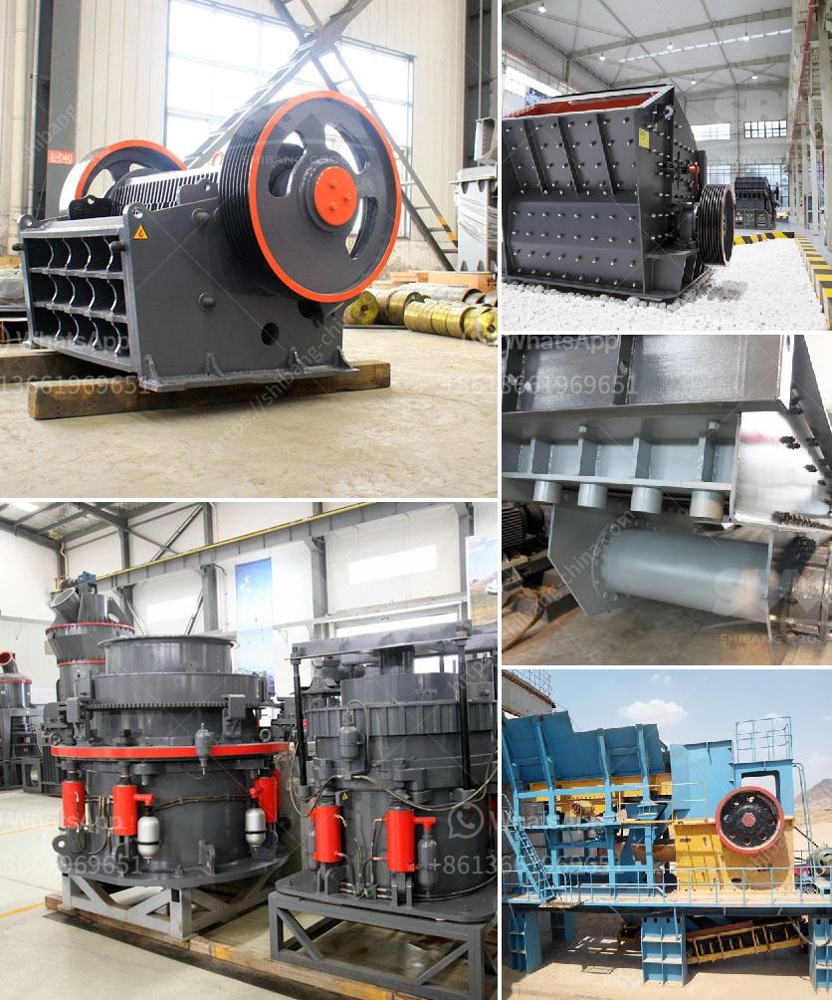

<h3>price of grinder machine in pakistan</h3>
In Pakistan, the grinder machine is an essential appliance in every household. It is used for grinding spices, grains, and lentils to make powders or pastes. This versatile appliance has made the kitchen tasks much easier and efficient. With a wide range of grinder machines available in the market, it is important to consider the price and features before making a purchase.

The price of a grinder machine in Pakistan varies depending on the make, design, and specifications of the machine. Generally, the price range starts from around 5,000 rupees and goes up to 10,000 rupees or more. However, there are also machines available at a higher price range with advanced features and functionalities.

For those on a budget, there are many affordable grinder machines available within the 5,000 to 7,000 rupee range. These machines offer basic grinding functions and are suitable for small households or individuals with limited requirements. They are compact in size and easy to use, making them a popular choice among budget-conscious buyers.

On the other hand, for those looking for a more advanced grinder machine, there are options available in the 7,000 to 10,000 rupee range. These machines come with multiple grinding jars, different speed settings, and additional features like a pulse function. They are perfect for larger families or individuals who require a variety of grinding options.

It is important to note that the price of grinder machines may also vary based on the brand. Some well-known brands may charge a higher price due to their reputation and reliability. It is recommended to do some research and read customer reviews before making a final decision.

In conclusion, the price range of grinder machines in Pakistan is generally between 5,000 to 10,000 rupees. Depending on the budget and requirements, buyers can choose from a variety of options available in the market. It is essential to consider factors like brand, design, and features before making a purchase to ensure the best value for money.
<h3>Contact us</h3><ul><li><strong>Whatsapp:&nbsp;<a href="https://wa.me/8613661969651">+8613661969651</a></strong></li><li><a href="https://swt.shibang-china.com/?git&amp;zhl&amp;price of grinder machine in pakistan"><strong>Online Service(chat now)</strong></a></li></ul><h3>Related</h3><ul><li><a href='19mm crusher stone philippines quarry.md'>19mm crusher stone philippines quarry</a></li><li><a href='roller grinding machines for sale.md'>roller grinding machines for sale</a></li><li><a href='mobile crushers for sale in nigeria.md'>mobile crushers for sale in nigeria</a></li><li><a href='grinding machine for bentonite.md'>grinding machine for bentonite</a></li><li><a href='coal crusher machine manufacturers.md'>coal crusher machine manufacturers</a></li></ul>