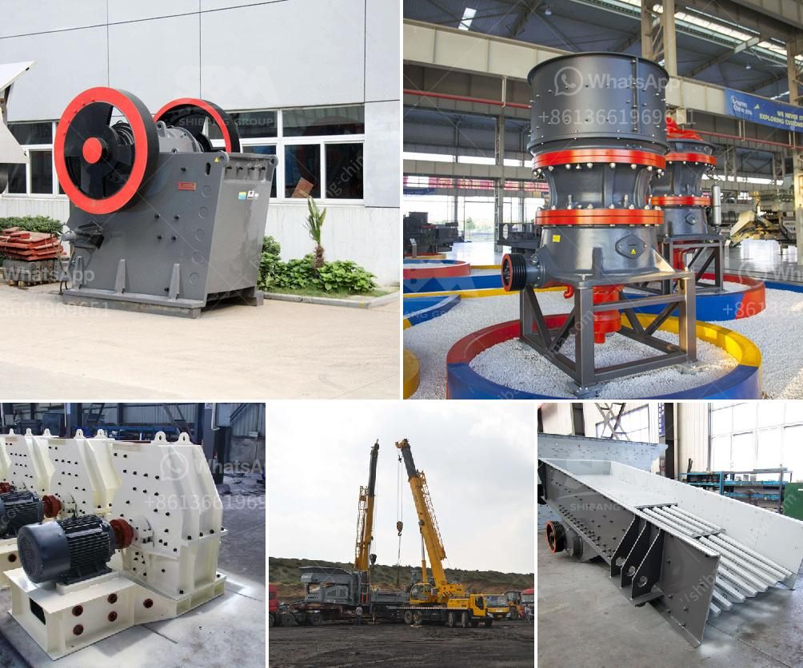

<h3>price of grinding machine for europe</h3>
Grinding machines play a vital role in various industries, enabling manufacturers to efficiently and precisely shape, sharpen, or finish mechanical components. In Europe, the market for grinding machines is thriving, driven by the region's robust manufacturing sector, technological advancements, and increasing demand for precision and durability.

When it comes to evaluating the price range of grinding machines in Europe, several factors must be considered. Firstly, the type and size of the machine greatly influence its cost. Grinding machines can be classified into various categories such as cylindrical, surface, centerless, and tool and cutter grinders, each requiring different levels of expertise, components, and technologies. Additionally, the size of the machine, determined by the grinding wheel diameter and the dimensions of workpieces it can handle, affects the price significantly.

The quality and reliability of grinding machines heavily rely on the manufacturing materials and technologies employed. The machines designed with high-quality materials and advanced technologies tend to be more expensive. Considering the requirements of grinding applications, some machines are built to withstand heavy workloads, resulting in higher prices due to increased durability and reliability.

Furthermore, the technological sophistication of grinding machines can influence their prices in the European market. Modern grinding machines often incorporate computer numerical control (CNC) systems, allowing for precise and automated operations, reducing manual intervention, and enhancing productivity. Consequently, CNC-equipped grinding machines tend to be more expensive due to the added software, hardware, and integration requirements.

The competition among grinding machine manufacturers in Europe also plays a crucial role in shaping the prices. Established manufacturers with a strong market presence may price their machines higher compared to newer or less established companies. Factors such as brand reputation, product performance, customer service, and after-sales support contribute to the perceived value of the machines and their pricing.

Lastly, additional features, accessories, and attachments can impact the price range of grinding machines. Optional components such as coolant systems, automatic tool changers, digital readouts, and advanced safety features can significantly increase the overall cost. However, these features often provide added convenience, precision, and safety, which may justify the higher prices for certain customers.

In conclusion, the price range of grinding machines in Europe varies depending on multiple factors, including machine type, size, manufacturing materials, technological sophistication, competition, and additional features. Buyers must consider their specific requirements, budget, and long-term goals to make informed purchasing decisions. Europe's grinding machine market presents a wide range of options, ensuring that manufacturers in various industries can find machines that suit their needs while also considering their financial constraints.
<h3>Contact us</h3><ul><li><strong>Whatsapp:&nbsp;<a href="https://wa.me/8613661969651">+8613661969651</a></strong></li><li><a href="https://swt.shibang-china.com/?git&amp;zhl&amp;price of grinding machine for europe"><strong>Online Service(chat now)</strong></a></li></ul><h3>Related</h3><ul><li><a href='portable stone crusher philippines.md'>portable stone crusher philippines</a></li><li><a href='calcium carbonate grinding technology.md'>calcium carbonate grinding technology</a></li><li><a href='vertical roller mill for cement.md'>vertical roller mill for cement</a></li><li><a href='stone crusher machine of 150 tonnes price.md'>stone crusher machine of 150 tonnes price</a></li><li><a href='used ball milling machine for sale canada.md'>used ball milling machine for sale canada</a></li></ul>