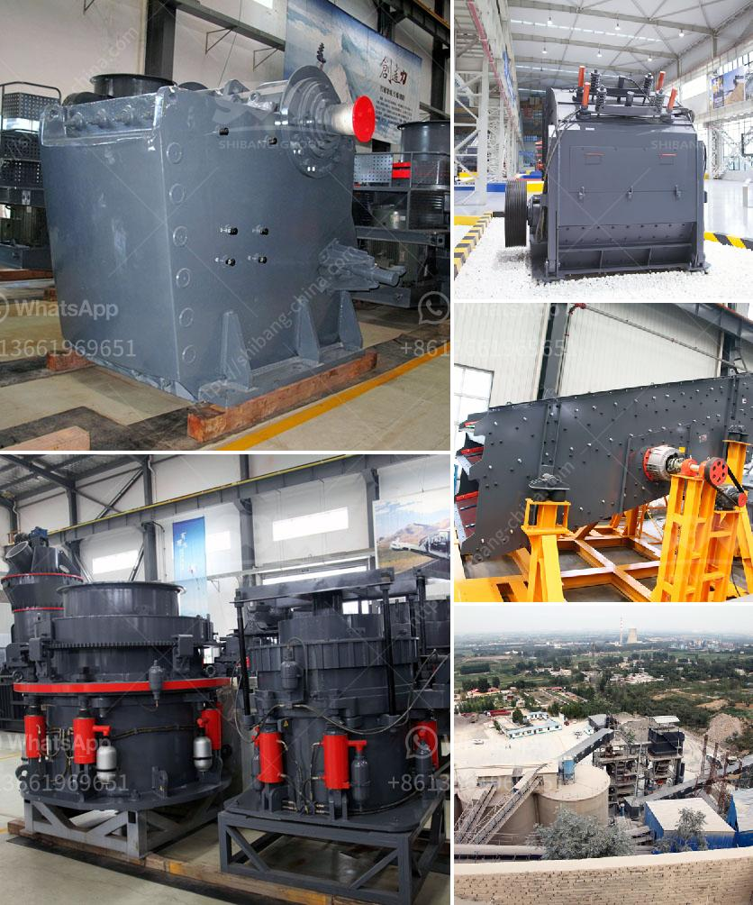

<h3>price of gypsum processing plant</h3>
The price of gypsum processing plant is an important consideration for many companies in their production processes. Gypsum powder is widely used in various industries, such as construction, agriculture, electrical, and medical, due to its diverse range of applications. Therefore, setting up a gypsum processing plant is essential for businesses to deliver high-quality products to their customers.

The price of gypsum processing plant is influenced by various factors, including equipment, transportation, labor, and raw material costs. These costs can vary depending on the scale of the plant and the production capacity. Additionally, the location of the plant can also impact the price.

Equipment costs play a significant role in determining the price of a gypsum processing plant. The machinery required for this process includes crushers, conveyors, vibrating feeders, grinding mills, and packaging machines. These machines can be costly, especially if high-quality and durable equipment is chosen to ensure efficient operation and longevity. The size and capacity of the equipment also affect the overall price, as larger machinery is typically more expensive.

Transportation costs are another crucial aspect to consider, as gypsum is often mined in specific geographical areas. Shipping raw materials to the processing plant can be costly, especially if the plant is located far from the source of gypsum deposits. Companies must evaluate transportation options and choose the most cost-effective solution that ensures a steady supply of raw materials.

Labor costs are a significant consideration in the overall price of a gypsum processing plant. Skilled workers are essential for operating and maintaining the equipment. Additionally, hiring administrative staff, managers, and supervisors is necessary to ensure the smooth running of the plant. Labor costs can vary depending on the location of the plant, the skill level required, and local labor market conditions.

Raw material costs are another essential factor in determining the price of gypsum processing plants. The price of gypsum can fluctuate due to various factors, such as supply and demand, production, and economic conditions. It is essential for companies to monitor gypsum prices to forecast potential price fluctuations and adjust their operations accordingly.

In conclusion, the price of a gypsum processing plant is influenced by numerous factors, including equipment, transportation, labor, and raw material costs. Companies must carefully evaluate these costs to determine the feasibility of setting up a processing plant and to ensure the profitability and competitiveness of their businesses. By considering these factors, companies can make informed decisions and invest in efficient, cost-effective gypsum processing plants that will enable them to deliver high-quality products to their valued customers.
<h3>Contact us</h3><ul><li><strong>Whatsapp:&nbsp;<a href="https://wa.me/8613661969651">+8613661969651</a></strong></li><li><a href="https://swt.shibang-china.com/?git&amp;zhl&amp;price of gypsum processing plant"><strong>Online Service(chat now)</strong></a></li></ul><h3>Related</h3><ul><li><a href='mobile crushing plants.md'>mobile crushing plants</a></li><li><a href='mobile aggregates washing plant.md'>mobile aggregates washing plant</a></li><li><a href='stone jaw crushers in japan.md'>stone jaw crushers in japan</a></li><li><a href='how much does sand processing plant cost.md'>how much does sand processing plant cost</a></li><li><a href='vertical roller mill for cement.md'>vertical roller mill for cement</a></li></ul>