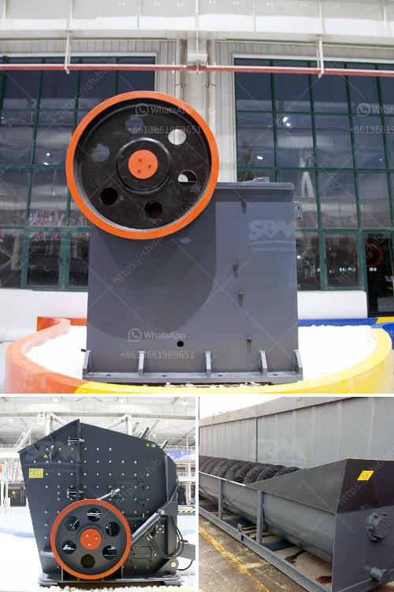

<h3>price of industrial hammer mill</h3>
Hammer mill is becoming increasingly popular in the manufacturing industry due to its ability to efficiently reduce the size of materials. Also known as a grinder, hammer mills are commonly used in industries such as mining, construction, agriculture, and chemical. They are designed to grind materials into fine particles or turn them into a powder form, making them suitable for further processing or use.

One crucial factor to consider when purchasing a hammer mill is its price. The price can vary significantly depending on various factors such as the size, capacity, and features of the mill. Hammer mills are available in a wide range of sizes, from small, portable models to large industrial ones. The price of a hammer mill typically increases with its size, due to the cost of materials and manufacturing.

The capacity of a hammer mill also affects its price. Higher-capacity mills can process more materials at a time, leading to higher production rates. As a result, mills with a higher capacity often come with a higher price tag. However, it is essential to choose a hammer mill with the appropriate capacity for your specific needs. Buying a mill with excess capacity may be a waste of money, while purchasing one with insufficient capacity can hinder your production.

Features and specifications also play a role in determining the price of an industrial hammer mill. Some mills come with additional features such as variable speed control, built-in screens for different particle sizes, or the ability to handle specific materials like wood or corn. These additional features can significantly increase the price of a hammer mill. However, they may be worth the investment if they enhance the efficiency and versatility of the mill for your specific applications.

Another factor that contributes to the price of an industrial hammer mill is the brand. Well-known and reputable brands often come with a higher price due to their quality and reliability. While it might be tempting to opt for a cheaper, lesser-known brand, it is crucial to consider the long-term costs and potential issues that may arise from using an inferior product.

On average, the price of an industrial hammer mill ranges from a few thousand dollars to tens of thousands of dollars. The prices vary widely based on the factors mentioned earlier, as well as market demand and competition. It is advisable to compare prices and features from different suppliers to ensure you get the best value for your money.

When considering the price of a hammer mill, it is vital to remember that it is just one aspect of the overall cost. Other costs, such as installation, maintenance, and energy consumption, should also be taken into account. Additionally, consider the potential return on investment that the hammer mill can provide in terms of increased productivity, reduced labor costs, and improved product quality.

In conclusion, the price of an industrial hammer mill can vary significantly depending on factors such as size, capacity, features, and brand. It is crucial to carefully consider your specific needs and budget when choosing a hammer mill. While price is an essential consideration, it should not be the sole determining factor. Investing in a high-quality hammer mill that meets your requirements can provide long-term benefits and contribute to the success of your manufacturing operations.
<h3>Contact us</h3><ul><li><strong>Whatsapp:&nbsp;<a href="https://wa.me/8613661969651">+8613661969651</a></strong></li><li><a href="https://swt.shibang-china.com/?git&amp;zhl&amp;price of industrial hammer mill"><strong>Online Service(chat now)</strong></a></li></ul><h3>Related</h3><ul><li><a href='stone cutting machine in india.md'>stone cutting machine in india</a></li><li><a href='ball mill vs vertical roller mill pdf.md'>ball mill vs vertical roller mill pdf</a></li><li><a href='stone crusher seller.md'>stone crusher seller</a></li><li><a href='hot used trommel screen machine in sand.md'>hot used trommel screen machine in sand</a></li><li><a href='enquiry about impact crusher.md'>enquiry about impact crusher</a></li></ul>