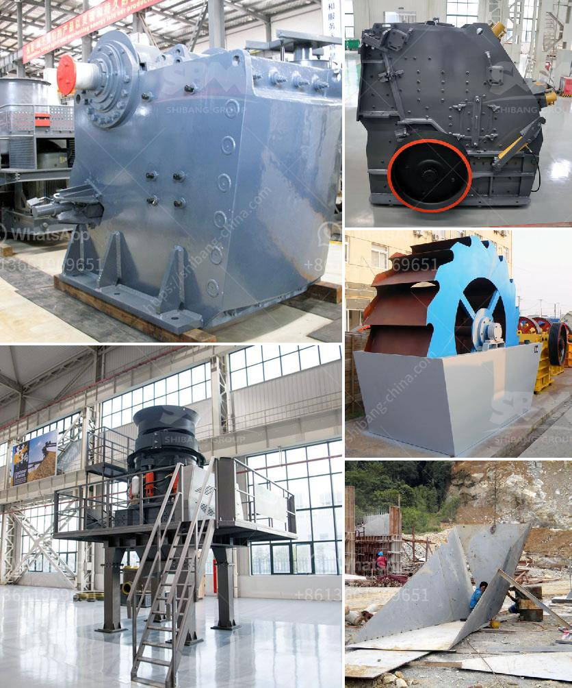

<h3>price of plant crusher in nigeria</h3>
The price of the plant crusher in Nigeria is based on the model, brand, capacity, and the after-sales service. The plant crusher operators in Nigeria are looking for efficient plants that will provide uninterrupted crushing operations without any downtime.

According to Crushing Plant Price in Nigeria, the crusher plant cost in Nigeria is based on the current crushing stage, the machine being used, and the annual output. However, a good stone crusher machine manufacturer understands that the upfront cost of the equipment is not the only factor to consider when purchasing a plant crusher.

In addition to the purchase price, there are other costs that need to be considered, especially the operating costs. These costs include fuel consumption, maintenance, and repairs. It is important to choose a crusher plant with a low fuel consumption rate to reduce the operating costs. Similarly, a reliable crusher plant will require minimal maintenance and repairs, saving you additional expenses in the long run.

Another important factor to consider is the after-sales service provided by the manufacturer. It is crucial to choose a manufacturer that offers excellent after-sales service, including timely spare parts availability, technical support, and assistance in case of any operational issues. This will ensure that your crusher plant runs smoothly and efficiently, minimizing any downtime.

In conclusion, the price of a crusher plant in Nigeria is influenced by various factors, including the model, brand, capacity, and after-sales service. It is important to consider not only the upfront cost of the equipment but also the operating costs, fuel consumption, and the after-sales service provided by the manufacturer. By taking all these factors into account, you can choose a crusher plant that will provide efficient crushing operations at a reasonable price.
<h3>Contact us</h3><ul><li><strong>Whatsapp:&nbsp;<a href="https://wa.me/8613661969651">+8613661969651</a></strong></li><li><a href="https://swt.shibang-china.com/?git&amp;zhl&amp;price of plant crusher in nigeria"><strong>Online Service(chat now)</strong></a></li></ul><h3>Related</h3><ul><li><a href='limestone grinding machine manufacturers in india.md'>limestone grinding machine manufacturers in india</a></li><li><a href='iron ore concentrate machinery.md'>iron ore concentrate machinery</a></li><li><a href='ball mill mexico.md'>ball mill mexico</a></li><li><a href='beneficiation small scale tin ore processing plant.md'>beneficiation small scale tin ore processing plant</a></li><li><a href='100 tph stone crusher price.md'>100 tph stone crusher price</a></li></ul>