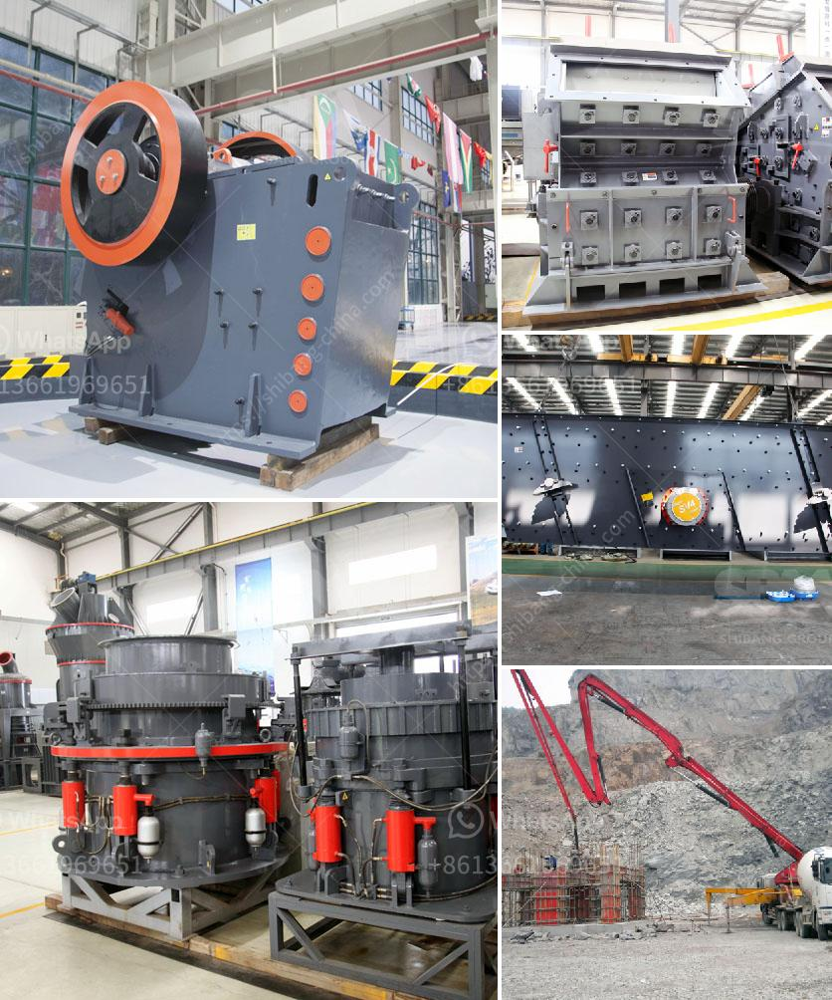

<h3>price of plant mobile crusher</h3>
The price of a mobile crusher can vary greatly depending on the size, power, and capacity of the machine. In general, the price range for a mobile crusher can range from tens of thousands of dollars to hundreds of thousands of dollars.

The price of the plant mobile crusher is affected by multiple factors, such as the type of crusher, the capacity of the machine, the required particle size, the materials being crushed, and the geographical location where the machine is being used.

Firstly, the type of crusher plays a significant role in determining the price. There are various types of mobile crushers available in the market, such as jaw crushers, cone crushers, impact crushers, and screens. Each type has different features and capabilities, which can impact the price. Generally, jaw crushers are more affordable compared to cone crushers and impact crushers.

Secondly, the capacity of the mobile crusher affects its price. Higher capacity crushers are generally priced higher than lower capacity ones. This is because higher capacity machines require stronger and more durable components to handle the increased workload. Additionally, high-capacity crushers may have advanced features and technologies that contribute to their higher price.

The required particle size is another crucial factor in determining the price of a mobile crusher. Crushers that produce smaller particle sizes typically have higher prices as they often require more sophisticated crushing mechanisms and additional processes, such as screening and filtering, to achieve the desired product size.

The materials being crushed by the mobile crusher can also affect its price. Some crushers are specifically designed for crushing certain materials, such as concrete, asphalt, or ores. These specialized crushers may have higher prices due to their unique capabilities.

Moreover, the geographical location where the mobile crusher is being used can impact its price. Different regions or countries may have varying regulations, taxes, import duties, and transportation costs, which can affect the overall price. Some regions may have higher costs associated with importing or transporting heavy machinery, which can inflate the price of the mobile crusher.

It is essential to consider all these factors when evaluating the price of a plant mobile crusher. Buyers should carefully assess their requirements, such as the required capacity, particle size, and materials, to determine the appropriate type and specifications of the crusher. Additionally, it is advisable to compare prices from different suppliers or manufacturers to ensure a fair and competitive price.

In conclusion, the price of a plant mobile crusher can vary significantly based on factors such as the type of crusher, capacity, required particle size, materials being crushed, and the geographical location. It is crucial for buyers to consider these factors and assess their needs to make an informed decision while purchasing a mobile crusher.
<h3>Contact us</h3><ul><li><strong>Whatsapp:&nbsp;<a href="https://wa.me/8613661969651">+8613661969651</a></strong></li><li><a href="https://swt.shibang-china.com/?git&amp;zhl&amp;price of plant mobile crusher"><strong>Online Service(chat now)</strong></a></li></ul><h3>Related</h3><ul><li><a href='rock crushing machine nigeria.md'>rock crushing machine nigeria</a></li><li><a href='lime mining crusher in india.md'>lime mining crusher in india</a></li><li><a href='used jaw crushers from oman.md'>used jaw crushers from oman</a></li><li><a href='how to build a concrete crusher.md'>how to build a concrete crusher</a></li><li><a href='mining processing machine prices.md'>mining processing machine prices</a></li></ul>