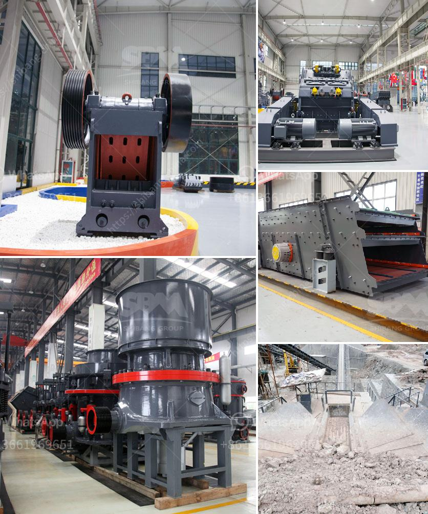

<h3>price of plants crushing</h3>
In recent years, there has been a surge in the demand for plants crushing services. Whether it is for construction, landscaping, or agricultural purposes, crushing plants play a crucial role in transforming raw materials into usable products. However, when it comes to the price of plants crushing, several factors need to be considered.

First and foremost, the cost is influenced by the type and size of the plant being used. Different plants have different capabilities, ranging from small compact crushers to large and powerful ones. The bigger the plant, the higher the price due to the increased capacity and efficiency it offers. The type of plants crushing required also makes a difference. For instance, certain plants are designed for primary crushing, while others are specialized for secondary or tertiary crushing. These variations impact the overall cost of the equipment.

Additionally, the geographical location of the crushing project affects the price too. Transporting heavy machinery long distances can be costly, especially when considering fuel expenses and necessary permits. Moreover, the availability of plants crushing services in specific areas can also affect the market price. Areas with a high demand and limited supply may result in higher costs due to competition among service providers.

Furthermore, the duration and complexity of the project influence the pricing as well. Some projects may require a long-term commitment, while others may be short-term ventures. The more extensive and intricate the project, the more likely it is that additional costs will be incurred to meet specific requirements. This can include additional manpower, specialized equipment, or permits, all of which contribute to the overall price.

Lastly, it is important to consider maintenance and operational costs. Plants crushing equipment requires regular inspections, maintenance, and repairs to ensure they function optimally. These ongoing expenses should be factored into the overall cost of the service.

In conclusion, the price of plants crushing is influenced by various factors. The size and type of plant, geographical location, project complexity, and maintenance costs all play significant roles in determining the price tag. Therefore, it is crucial for potential clients to evaluate these factors and obtain quotes from multiple service providers to select the best option that matches their requirements and budget. Understanding the cost dynamics involved will enable clients to make informed decisions, ensuring efficient and cost-effective plants crushing operations.
<h3>Contact us</h3><ul><li><strong>Whatsapp:&nbsp;<a href="https://wa.me/8613661969651">+8613661969651</a></strong></li><li><a href="https://swt.shibang-china.com/?git&amp;zhl&amp;price of plants crushing"><strong>Online Service(chat now)</strong></a></li></ul><h3>Related</h3><ul><li><a href='recycling of material in construction.md'>recycling of material in construction</a></li><li><a href='coal crusher specification pdf.md'>coal crusher specification pdf</a></li><li><a href='cement processing plant.md'>cement processing plant</a></li><li><a href='manufacturing process of bentonite powder.md'>manufacturing process of bentonite powder</a></li><li><a href='basalt processing plant.md'>basalt processing plant</a></li></ul>