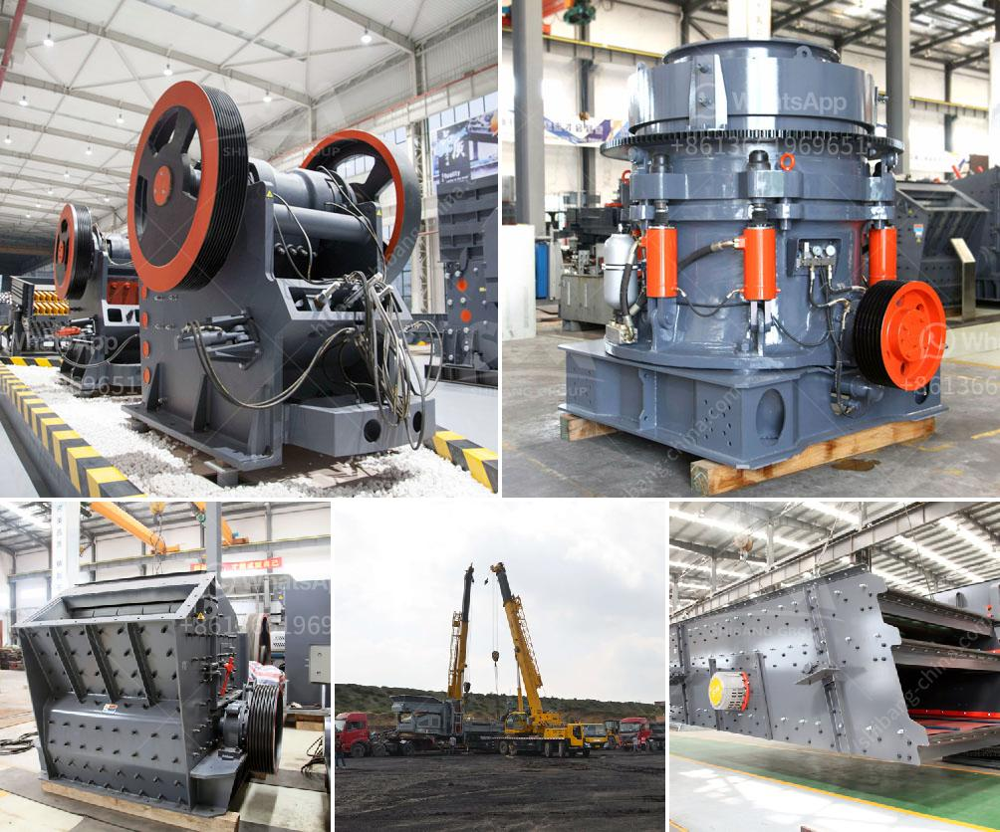

<h3>price of quarry crusher machines</h3>
The price of quarry crusher machines is one of the concerns of many customers when purchasing quarry crusher machines. In order to ensure the production cost of quarry crusher machines, manufacturers will supply a wide variety of quarry crushing machinery for sale with different specifications and capacity. The prices also vary depending on the features and functions of the quarry crusher machines.

Generally, speaking, the quarry crusher machines can be divided into three major types, namely, jaw crusher, impact crusher and cone crusher. Jaw crusher is often used as the primary crushing equipment, which is suitable for most crushing processes. As the second crushing equipment, impact crusher is widely used in the medium crushing and fine crushing of various materials. Cone crusher is mainly used in the fine crushing process of hard rock ore, coal, and other materials.

The price of quarry crusher machines is influenced by many factors such as the manufacturer, product quality, production cost, market competition, and economic environment. Therefore, in order to purchase quarry crusher machines with high quality and low price, some factors should be taken into consideration as follows:

Firstly, it is important to choose a reliable and professional manufacturer. A reliable manufacturer can provide high-quality quarry crusher machines and comprehensive after-sales service, which can guarantee the smooth operation of the equipment and reduce maintenance costs. In addition, a professional manufacturer can also provide customized solutions according to the actual needs of customers, which can improve the production efficiency and reduce the investment cost.

Secondly, the quality of quarry crusher machines should be carefully checked. The quality of quarry crusher machines directly affects the crushing efficiency and material utilization. High-quality quarry crusher machines can ensure stable and efficient production, and can significantly reduce the maintenance and repair costs. On the contrary, low-quality quarry crusher machines may have frequent failures, which will greatly increase the production cost.

Thirdly, the price of quarry crusher machines should be reasonable. Compared with similar industries, the prices of quarry crusher machines are relatively low. However, due to the large number of manufacturers, the price competition among manufacturers is also very fierce. Therefore, customers should compare the prices of different manufacturers and choose the most cost-effective equipment.

Finally, it is necessary to consider the production capacity and production efficiency of quarry crusher machines. The production capacity of quarry crusher machines can directly affect the production efficiency. Therefore, customers should choose the equipment with appropriate production capacity according to their actual needs. In addition, customers should also pay attention to the energy consumption of the equipment. Quarry crusher machines with high production efficiency and low energy consumption can significantly reduce the production cost.

In conclusion, the price of quarry crusher machines is influenced by many factors. In order to select quarry crusher machines with high quality and low price, customers should consider the manufacturer, product quality, production cost, market competition, and economic environment. Only by choosing the right quarry crusher machines can customers achieve efficient production and reduce investment and production costs.
<h3>Contact us</h3><ul><li><strong>Whatsapp:&nbsp;<a href="https://wa.me/8613661969651">+8613661969651</a></strong></li><li><a href="https://swt.shibang-china.com/?git&amp;zhl&amp;price of quarry crusher machines"><strong>Online Service(chat now)</strong></a></li></ul><h3>Related</h3><ul><li><a href='clay crusher processing in india.md'>clay crusher processing in india</a></li><li><a href='how stone crusher works.md'>how stone crusher works</a></li><li><a href='stone crushers baby.md'>stone crushers baby</a></li><li><a href='crushers discarded stone crusher.md'>crushers discarded stone crusher</a></li><li><a href='wet ground mica powder mill equipment supplier.md'>wet ground mica powder mill equipment supplier</a></li></ul>