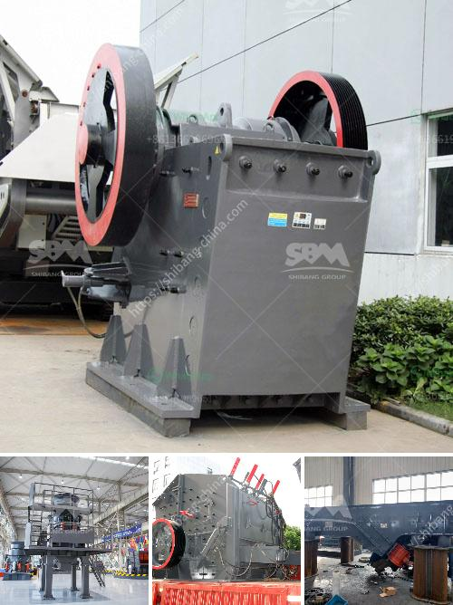

<h3>price of raymond used for crushing the powder stones</h3>
Raymond mill, also known as Raymond grinding mill, is commonly used in industrial production and mining machinery. It is a special equipment for grinding various kinds of materials, such as ore, gypsum, coal, calcium carbonate, etc. With its advanced technology and exquisite craftsmanship, Raymond mill has become one of the most popular machinery in the mining industry.

When it comes to the price of Raymond used for crushing powder stones, several factors should be taken into consideration. Firstly, the price of Raymond mill varies with different manufacturers. Different brands may have different prices due to their reputation, quality, and after-sales service. Therefore, it is important to thoroughly research and compare different manufacturers before making a purchase.

Secondly, the price of Raymond mill is influenced by its model and specifications. Raymond mills with different capacities and power consumption will have different prices. Generally, the larger the production capacity, the higher the price. However, it is crucial to choose a suitable model according to your needs to avoid unnecessary investment.

Furthermore, the price of Raymond mill is also affected by market demand and supply. When the demand for Raymond mills is high, the price may increase due to market competition. On the contrary, when the demand is low, the price may decrease to stimulate sales. Therefore, it is recommended to pay attention to the market trends and make a purchase at the most favorable time.

Moreover, the price of Raymond mill may be influenced by other factors, such as transportation costs, import and export policies, and exchange rates. Therefore, it is advisable to consult with professionals or experts in the industry to get accurate and up-to-date information about the price.

In conclusion, the price of Raymond used for crushing powder stones can vary depending on several factors, such as brand reputation, model specifications, market demand and supply, and other external factors. Therefore, it is essential to do thorough research, compare prices, and consider your specific needs before purchasing Raymond mill. This will ensure that you make an informed decision and get the most value for your investment.
<h3>Contact us</h3><ul><li><strong>Whatsapp:&nbsp;<a href="https://wa.me/8613661969651">+8613661969651</a></strong></li><li><a href="https://swt.shibang-china.com/?git&amp;zhl&amp;price of raymond used for crushing the powder stones"><strong>Online Service(chat now)</strong></a></li></ul><h3>Related</h3><ul><li><a href='fastest gold hammer mill in china.md'>fastest gold hammer mill in china</a></li><li><a href='second hand stone production line for.md'>second hand stone production line for</a></li><li><a href='mtw european type trapezium mill.md'>mtw european type trapezium mill</a></li><li><a href='manufacturing artificial sand in malaysia.md'>manufacturing artificial sand in malaysia</a></li><li><a href='used ball mill south africa.md'>used ball mill south africa</a></li></ul>