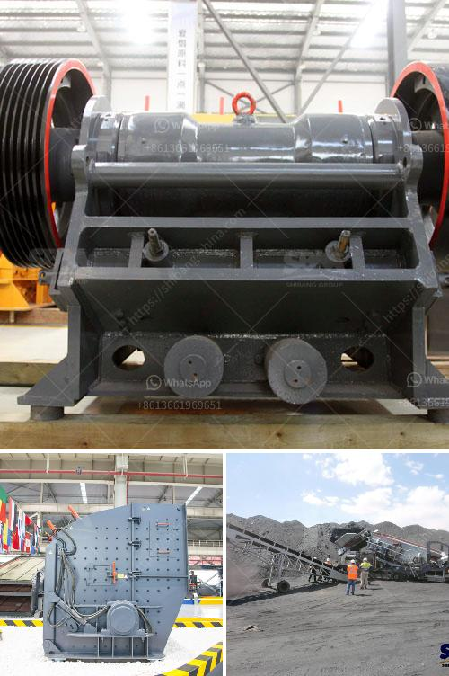

<h3>price of stone crusher size</h3>
The price of a stone crusher is usually determined by the specific requirements of clients. The machine you choose will depend on the property, nature, and size of the stones you want to crush, as well as the desired output size, production capacity, and your budget. There are several factors that influence the price of a stone crusher machine, which we will discuss in this article.

Firstly, the brand awareness and reputation of the manufacturer play an important role. A well-known and reputable manufacturer will often price their machines higher than lesser-known manufacturers. This is because they have a proven track record of producing high-quality and reliable equipment. When it comes to crushing stones, you want a machine that will last for many years and provide the necessary output. Therefore, it is worth investing in a machine from a trusted brand.

Secondly, the size of the stone crusher machine is another factor that influences the price. The smaller the size, the cheaper it will be, as customers typically prefer smaller machines that are easy to move and carry. The size of the machine also affects its production capacity. If you need to crush a large quantity of stones in a short time, you will require a larger machine with a higher capacity, which will result in a higher price.

Additionally, there are different types of stone crushers available in the market, such as jaw crushers, cone crushers, impact crushers, and hammer crushers. Each type has its own unique features and advantages. Jaw crushers are particularly suitable for primary crushing, while cone crushers are commonly used for secondary or tertiary crushing. Impact crushers are used for crushing medium-hard stones, and hammer crushers are used for crushing brittle and hard materials.

Furthermore, the output size required by the customer also affects the price of the stone crusher. Different machines have different capabilities to crush stones into different sizes. Therefore, if you have specific requirements for the output size, it may influence the type of crusher you choose and consequently affect the price.

Lastly, the production capacity of the stone crusher machine is an important factor in determining its price. The higher the production capacity, the more expensive the machine will be. If you have a large-scale construction project that requires a high volume of crushed stones, you will need a machine with a larger production capacity, which will be priced higher than machines with lower capacity.

In conclusion, the price of a stone crusher machine is influenced by various factors, such as the brand, size, type, output capacity, and customer requirements. It is wise to contact multiple suppliers and compare prices to ensure you are getting the best deal. Remember, investing in a high-quality machine will result in long-term durability and productivity, making it a worthwhile investment for your construction projects.
<h3>Contact us</h3><ul><li><strong>Whatsapp:&nbsp;<a href="https://wa.me/8613661969651">+8613661969651</a></strong></li><li><a href="https://swt.shibang-china.com/?git&amp;zhl&amp;price of stone crusher size"><strong>Online Service(chat now)</strong></a></li></ul><h3>Related</h3><ul><li><a href='gravel crusher supplier in the philippines.md'>gravel crusher supplier in the philippines</a></li><li><a href='cement plant process in south africa.md'>cement plant process in south africa</a></li><li><a href='used sand screening plant for sale in uae.md'>used sand screening plant for sale in uae</a></li><li><a href='indonesia roll crushers.md'>indonesia roll crushers</a></li><li><a href='jaw crusher and cone crusher manufacturers in dubai.md'>jaw crusher and cone crusher manufacturers in dubai</a></li></ul>