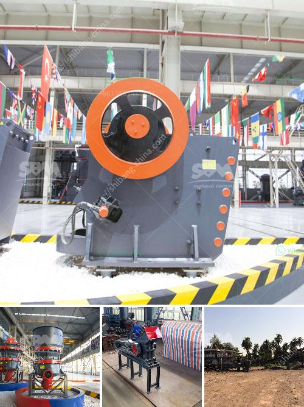

<h3>price of stone crushing machine in nigeria</h3>
The price of stone crushing machine in Nigeria has always been a major concern for customers. Many customers have noticed this problem early on, so they began to buy stone crushing machines, hoping to make money. But sometimes they also worry about the quality of these machines. After all, quality is the cornerstone of a company's development.

These machines have different prices depending on their models, sizes, and output capacities. Therefore, customers need to consider the key factors when choosing crushing machines.

Firstly, it is important to consider the material to be crushed and its hardness. The hardness and wear resistance of the material directly affect the production efficiency and service life of the machine. Therefore, customers should choose machines with appropriate capabilities.

Secondly, it is necessary to consider the specifications and models of the machines. Different models have different performance parameters, such as capacity, discharge size, and power consumption. Customers should choose the appropriate model based on their production needs.

Cost is also an important factor to consider. Different suppliers offer machines at different prices depending on their brand reputation, production skills, and after-sales service. It is important to find a reliable and reputable supplier who offers cost-effective machines.

Generally, the price range of stone crushing machines in Nigeria is around NGN 60,000 to NGN 76,000. However, this price range is not static and the final price depends on various factors such as the features of the machine, the capacity, and other auxiliary equipment needed.

Investing in the stone crushing machine in Nigeria can be both expensive and profitable. Companies that utilize stone crushing machines are looking to expand their business by increasing the production capacity. With the increasing demand for stone crushers, the manufacturers are introducing new models with advanced technologies to meet the growing needs of customers. Hence, the market competition in Nigeria is fierce.

In conclusion, the price of stone crushing machine in Nigeria is influenced by various factors, including the quality and durability of the machine, the production capacity, the brand reputation, and the after-sales service provided by the supplier. The price range is widely recognized in the market for its reasonable price and high cost performance. On the other hand, Nigeria's economic development and infrastructure construction require a large amount of construction aggregates, resulting in a large demand for stone crushing machines. This provides a great opportunity for the development of stone crushing business in Nigeria. 
<h3>Contact us</h3><ul><li><strong>Whatsapp:&nbsp;<a href="https://wa.me/8613661969651">+8613661969651</a></strong></li><li><a href="https://swt.shibang-china.com/?git&amp;zhl&amp;price of stone crushing machine in nigeria"><strong>Online Service(chat now)</strong></a></li></ul><h3>Related</h3><ul><li><a href='gold crushers sale.md'>gold crushers sale</a></li><li><a href='second hand crusher to buy in zambia.md'>second hand crusher to buy in zambia</a></li><li><a href='mill crusher pigment manufacturer in kenya.md'>mill crusher pigment manufacturer in kenya</a></li><li><a href='china clay processing plant.md'>china clay processing plant</a></li><li><a href='gypsum board manufacturing machine.md'>gypsum board manufacturing machine</a></li></ul>