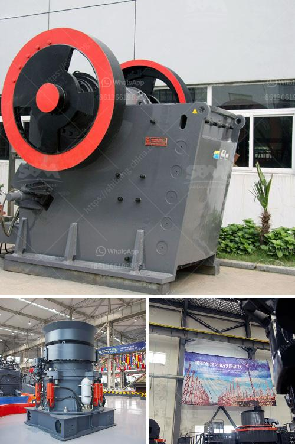

<h3>price of washed chrome ore</h3>
The price of washed chrome ore has become a topic of interest in the mining industry as it plays a crucial role in various sectors of the economy. Chrome ore, a key ingredient in the production of stainless steel, is in high demand due to its corrosion resistance and shiny finish.

The price of washed chrome ore is influenced by several factors. Firstly, the global supply and demand dynamics significantly impact the price. When demand for stainless steel products is high, the price of chrome ore tends to rise, as stainless steel manufacturers require more raw materials to meet the growing demand. Similarly, disruptions in the supply chain, such as mining strikes or logistical challenges, can also drive up the price.

Additionally, the quality of the ore plays a vital role in determining its price. Washed chrome ore generally refers to processed ore that has undergone a washing process to remove impurities, resulting in a higher quality product. Buyers are willing to pay a premium for washed chrome ore due to its improved purity and consistency, which enhances the efficiency of the production process.

Moreover, geopolitical factors can impact the price of washed chrome ore. Chrome ore production is concentrated in a handful of countries, with South Africa being the largest producer followed by Kazakhstan and Turkey. Any political or economic fluctuations in these countries may influence the market dynamics and subsequently impact the price.

Furthermore, industrial policies and environmental regulations set by different governments can affect the price of washed chrome ore. Any changes in production quotas or stricter environmental regulations can lead to a decrease in supply, driving the price upwards.

In conclusion, the price of washed chrome ore is subject to various factors including supply and demand dynamics, the quality of the product, geopolitical factors, and government policies. The chrome ore market is expected to continue experiencing fluctuations as demand for stainless steel products increases. As the industry evolves, it is crucial for stakeholders to closely monitor these factors to make informed decisions and stay competitive in the market.
<h3>Contact us</h3><ul><li><strong>Whatsapp:&nbsp;<a href="https://wa.me/8613661969651">+8613661969651</a></strong></li><li><a href="https://swt.shibang-china.com/?git&amp;zhl&amp;price of washed chrome ore"><strong>Online Service(chat now)</strong></a></li></ul><h3>Related</h3><ul><li><a href='how to set up a granite quarry.md'>how to set up a granite quarry</a></li><li><a href='limestone crusher machine price.md'>limestone crusher machine price</a></li><li><a href='rock crushing and ballast.md'>rock crushing and ballast</a></li><li><a href='cost of small scale cement factory.md'>cost of small scale cement factory</a></li><li><a href='gypsum machine price.md'>gypsum machine price</a></li></ul>