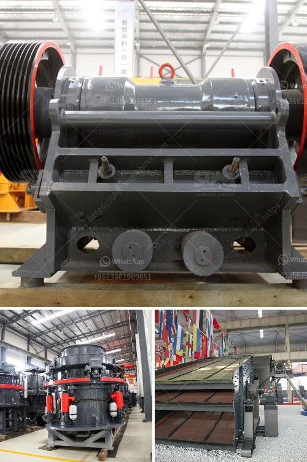

<h3>price of zenith crusher</h3>
The price of Zenith crusher is a hot topic in the mining industry. As a leading manufacturer and supplier of mining equipment, Zenith has been devoted to the research and development of crusher machine for many years. With rich experience and professional technology, Zenith is capable of providing customers with high-quality and high-performance crushers and related equipment. However, the price of Zenith crusher varies depending on the different models and configurations. In this article, we will analyze the factors that affect the price of Zenith crusher.

Firstly, the price of Zenith crusher is influenced by the production capacity. Different models of crushers have different production capacities. For example, the PE jaw crusher series includes several models, such as PE 500x750, PE 600x900, PE 750x1060, etc. The production capacity of these models ranges from 45 tons per hour to 800 tons per hour. And the price of crusher with higher production capacity is generally higher.

Secondly, the price of Zenith crusher is affected by the specifications and configuration of the machine. Crushers with different specifications have different prices. For example, the impact crusher series includes three models, namely PF 1010, PF 1210, and PF 1214. The feeding size of these models is 350mm, 350mm, and 350mm respectively. And the maximum feeding size of the VSI sand making machine series is 50mm, 60mm, and 70mm respectively. The larger the feeding size, the higher the price of the crusher.

Thirdly, the quality and performance of Zenith crusher also affect its price. Zenith is committed to producing high-quality crushers that meet customers' requirements. In order to ensure the quality of the machine, Zenith adopts advanced manufacturing technology and strict quality control. The machines are equipped with high-quality wear-resistant materials and advanced technology, which greatly improve the service life and performance of the crusher. As a result, the price of high-quality and high-performance crushers is relatively higher.

Furthermore, the price of Zenith crusher is also influenced by the market demand and competition. In the competitive market, the price of a product is determined by the supply and demand relationship. If the demand for crushers is high, the price may rise. On the contrary, if the demand is low, the price may decrease. In addition, the competition among manufacturers also affects the price. To attract more customers and gain market share, some manufacturers may reduce the price of their products. Therefore, the price of Zenith crusher is also affected by market demand and competition.

In conclusion, the price of Zenith crusher is influenced by various factors, including the production capacity, specifications and configuration, quality and performance, and market demand and competition. Customers should choose the crusher that suits their needs and budget based on these factors. Zenith offers a wide range of crushers with different prices and specifications to meet the diverse needs of customers. With superior quality and excellent performance, Zenith crusher deserves your trust and investment.
<h3>Contact us</h3><ul><li><strong>Whatsapp:&nbsp;<a href="https://wa.me/8613661969651">+8613661969651</a></strong></li><li><a href="https://swt.shibang-china.com/?git&amp;zhl&amp;price of zenith crusher"><strong>Online Service(chat now)</strong></a></li></ul><h3>Related</h3><ul><li><a href='mining equipment agent in iran.md'>mining equipment agent in iran</a></li><li><a href='100tpd gold processing plant.md'>100tpd gold processing plant</a></li><li><a href='cement plant process in south africa.md'>cement plant process in south africa</a></li><li><a href='vertical mill cement.md'>vertical mill cement</a></li><li><a href='puzzolana crusher plant nairobi kenya.md'>puzzolana crusher plant nairobi kenya</a></li></ul>