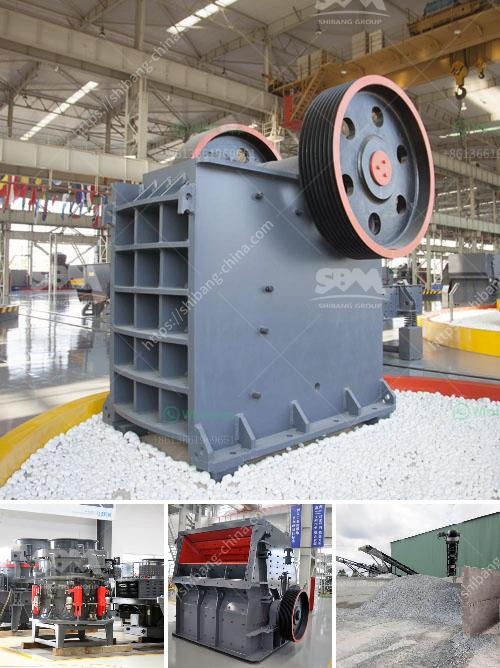

<h3>price stone crusher in nigeria</h3>
With the current economic downturn in Nigeria, and the worldwide slump in commodities prices, many people have resorted to buying items at a discount. These individuals, especially those in the construction sector, have found a way to reduce their costs by purchasing rocks and stone aggregates from local quarries. One of the essential items they require is stone crushers. Stone crushing machinery, also known as stone crushers, are indispensable machines in various mining industries such as construction and natural aggregates.

For many years, the mining industry in Nigeria has been booming due to the vast natural resources found in the country. Consequently, there has been a rise in demand for stones and rocks used in the construction of buildings, bridges, roads, and other structures. This has led to an increasing number of stone crushers being procured to cater to the growing industry. The price of these machines ranges from a few thousand dollars to several million dollars, depending on their capabilities and specifications.

In Nigeria, stone crushers are primarily used for crushing stones or rocks into smaller sizes for construction or road building purposes. The machines are usually sold in two main categories: portable and mobile. Portable stone crushers are designed to be moved from one site to another, allowing for greater flexibility when it comes to crushing materials. Mobile crushers, on the other hand, are stationary in nature and are commonly used in quarries and mines.

The price of stone crushers in Nigeria cannot be compared with other countries such as China or the United States, since the cost of transportation, manpower, and equipment is quite high in Nigeria. However, compared to other African countries like Malawi, Tanzania, and Zambia, Nigeria is not very expensive in terms of construction and mining equipment.

Stone crushers are available in various sizes, ranging from a few meters to hundreds of meters. According to their size, stone crushers can be divided into mini stone crushers, small stone crushers, medium-sized stone crushers, and large stone crushers. The maximum size of the stone crushing plant output is usually 1 inch to 8 inches. However, some larger machines can produce gravel and stone aggregates up to 20 inches in diameter.

Stone crushers are widely used in the mining industry, metallurgical, construction, chemistry, petrochemicals, transportation, energy, building materials industry, suitable for crushing high hard, mid hard, and soft rocks and ores such as iron ore, limestone, slag, marble, quartz, granite, cement, clinker, and so on.

When buying stone crushers in Nigeria, the price is not the only factor to be considered. To ensure that the chosen machine meets customers' specifications and requirements, it is essential to carefully review the specifications, capabilities, and features of the machine. In addition, it is crucial to compare prices and explore all available options before making a purchasing decision. Moreover, it is advisable to seek professional advice from experienced individuals or companies within the construction or mining industry.

In conclusion, the price of stone crushers in Nigeria has been steadily increasing over the years due to inflation, economic recession, and increased demand from the construction and mining sectors. However, with careful planning, research, and professional guidance, one can find a stone crusher within their budget that perfectly meets their requirements. Investing in a stone crusher can be a profitable venture for individuals and businesses involved in mining and construction activities in Nigeria.
<h3>Contact us</h3><ul><li><strong>Whatsapp:&nbsp;<a href="https://wa.me/8613661969651">+8613661969651</a></strong></li><li><a href="https://swt.shibang-china.com/?git&amp;zhl&amp;price stone crusher in nigeria"><strong>Online Service(chat now)</strong></a></li></ul><h3>Related</h3><ul><li><a href='egypt aggregate stone for concrete prices.md'>egypt aggregate stone for concrete prices</a></li><li><a href='ball mill in wait of ball.md'>ball mill in wait of ball</a></li><li><a href='clay crusher processing in india.md'>clay crusher processing in india</a></li><li><a href='coal crushing plant.md'>coal crushing plant</a></li><li><a href='slag ball mill crusher.md'>slag ball mill crusher</a></li></ul>