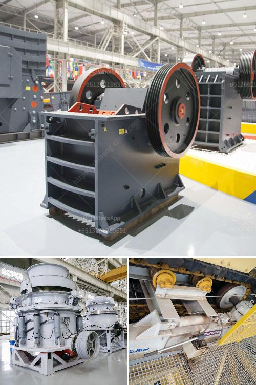

<h3>price stone crusher suppliers</h3>
With hundreds of manufacturers and suppliers in the market, finding reliable and affordable price stone crusher suppliers is not easy. Given the number of options available, it can be challenging to select the best supplier for your needs. However, by considering a few factors, you can find a suitable supplier who offers quality products at a reasonable price.

Firstly, it's essential to consider the reputation of the supplier. Online reviews and testimonials can provide valuable insights into the supplier's reliability and the quality of their products. Look for suppliers with positive feedback from previous clients, indicating their satisfaction with the stones and services provided.

Another crucial aspect to consider is the supplier's experience in the industry. A well-established supplier with years of experience is more likely to provide high-quality stones at competitive prices. They have developed networks with trustworthy manufacturers and understand the market trends, allowing them to offer the best products.

Price comparison is also vital when looking for a stone crusher supplier. Request quotes from multiple suppliers and compare their prices. However, keep in mind that the lowest price does not always equate to the best value. Consider the quality of the stones and the supplier's reputation alongside the price to make an informed decision.

When evaluating the quality of the stones supplied, it's important to consider factors such as durability, hardness, and size. The stones should be able to withstand heavy usage and resist wear and tear. Ensure that the supplier provides detailed specifications and can meet your specific requirements.

Additionally, it's beneficial to opt for a supplier who offers a wide range of stone crusher options. Different projects may require different types of stones, and having a variety of choices allows you to select the most suitable one. Whether you need limestone, granite, or shale stones, a supplier with a diverse inventory can cater to your needs.

Reliable customer service is another important factor to consider. A supplier who values their customers and is responsive to their queries and concerns can provide a positive buying experience. Prompt communication and after-sales support are crucial, as they ensure any issues or queries are resolved efficiently.

Furthermore, it's advisable to choose a supplier who offers convenient and flexible delivery options. Stone crushers are usually heavy and bulky, so timely and hassle-free delivery is crucial. Suppliers who have a reliable delivery network and can efficiently transport the stones to your location are preferred.

Lastly, consider the supplier's overall professionalism. The supplier should be registered, follow industry norms and regulations, and provide proper documentation for their products. This ensures that the stones supplied are legally obtained, reducing the risk of legal issues for your project.

In conclusion, finding reliable and affordable price stone crusher suppliers requires careful evaluation of their reputation, experience, price, quality, variety, customer service, delivery options, and professionalism. By considering these factors, you can select a supplier who offers high-quality stones at competitive prices, ensuring a successful project.
<h3>Contact us</h3><ul><li><strong>Whatsapp:&nbsp;<a href="https://wa.me/8613661969651">+8613661969651</a></strong></li><li><a href="https://swt.shibang-china.com/?git&amp;zhl&amp;price stone crusher suppliers"><strong>Online Service(chat now)</strong></a></li></ul><h3>Related</h3><ul><li><a href='diamond mining machine in south africa.md'>diamond mining machine in south africa</a></li><li><a href='stone crusher price list 300 tonnes capacity per hour.md'>stone crusher price list 300 tonnes capacity per hour</a></li><li><a href='uk made stone crushing machine.md'>uk made stone crushing machine</a></li><li><a href='mobile crusher sale germany.md'>mobile crusher sale germany</a></li><li><a href='granite and basalt crushing line ton per day.md'>granite and basalt crushing line ton per day</a></li></ul>