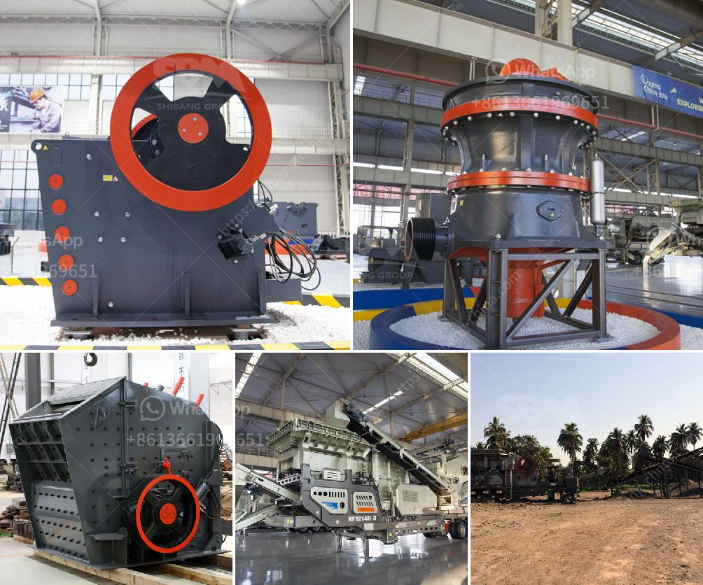

<h3>prices by hammer mills</h3>
Hammer mills are powerful machines used to shred or crush materials into smaller pieces. These machines have gained popularity due to their numerous applications in industries such as agriculture, mining, construction, and pharmaceuticals. But when it comes to buying a hammer mill, one of the main considerations is the price.

The price range of hammer mills can vary significantly depending on factors such as the size, capacity, and features of the machine. Smaller, less powerful models can be found at a relatively lower price, typically ranging from $1000 to $5000. These mills are ideal for small-scale operations or for those on a tight budget. They can handle small volumes of materials efficiently but may have limitations when it comes to processing harder or larger materials.

On the other end of the spectrum, larger and more heavy-duty hammer mills can have a price tag anywhere from $10,000 to $50,000 or more. These machines are built for high-capacity operations, able to process and pulverize a wide range of materials, including rocks, ores, and fibrous substances. They are typically equipped with more advanced features and controls, making them suitable for demanding applications in industries such as mining and construction.

It's worth noting that the price of a hammer mill is not solely determined by its size and capacity. Other factors such as the brand reputation, build quality, and after-sales support can also influence the price. Additionally, the inclusion of optional features such as dust collection systems or advanced safety devices can also drive up the cost.

When considering the price of a hammer mill, it's important to evaluate your specific needs and budget. Think about factors such as the volume and type of materials you'll be processing, the required efficiency, and the longevity of the equipment. It may be worth investing in a higher-priced, more durable model if it means better productivity and longer lifespan in the long run.

In conclusion, the price of hammer mills can vary widely based on factors such as size, capacity, features, and brand reputation. While smaller models offer affordability, larger and more heavy-duty units come at a higher price for their advanced capabilities. Assess your specific needs and budget carefully to find the right hammer mill that offers the best value for your investment.
<h3>Contact us</h3><ul><li><strong>Whatsapp:&nbsp;<a href="https://wa.me/8613661969651">+8613661969651</a></strong></li><li><a href="https://swt.shibang-china.com/?git&amp;zhl&amp;prices by hammer mills"><strong>Online Service(chat now)</strong></a></li></ul><h3>Related</h3><ul><li><a href='impact crusher machine manufacturer.md'>impact crusher machine manufacturer</a></li><li><a href='mobile quarry crusher euipment.md'>mobile quarry crusher euipment</a></li><li><a href='full quarry machines for sale in china.md'>full quarry machines for sale in china</a></li><li><a href='linear vibrating screen specifications.md'>linear vibrating screen specifications</a></li><li><a href='ton hour coal crusher and screen.md'>ton hour coal crusher and screen</a></li></ul>