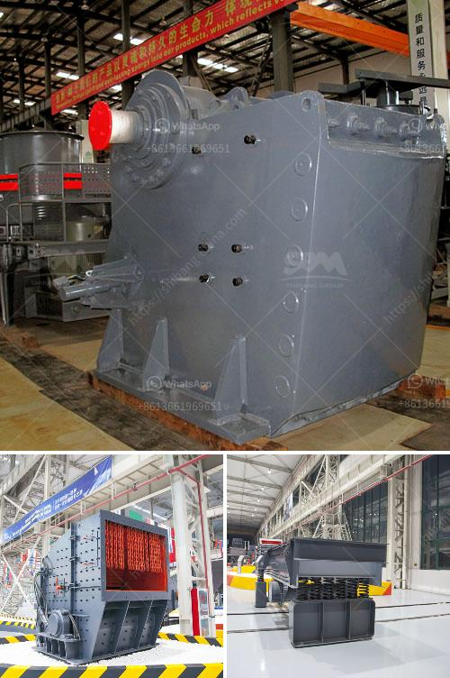

<h3>prices for granite crushers</h3>
Granite is a type of igneous rock that is commonly used as a building material. It has gained popularity due to its durability, strength, and aesthetic appeal. As a result, the demand for granite crushers has also increased.

Granite crushing is a tough task as it requires precision and skill. The crushers used for this process are jaw crushers, cone crushers, and impact crushers. These machines have different capacities and specifications based on the crushing requirements of the granite.

When it comes to purchasing granite crushers, the price plays a significant role in the decision-making process. Prices for granite crushers vary depending on various factors such as model, capacity, and brand. Generally, the price range starts from a few thousand dollars and can go up to tens of thousands of dollars.

The first factor that influences the price is the type of granite crusher. Jaw crushers are the most common type of crushers used in granite crushing. They are known for their simple structure, reliable performance, and ease of maintenance. Jaw crushers come in different sizes and capacities, and their prices vary accordingly.

Cone crushers are another popular choice for granite crushing. They are superior in terms of crushing efficiency and are commonly used for secondary and tertiary crushing. Cone crushers are more expensive than jaw crushers due to their advanced features and higher capacity.

Impact crushers are also used in granite crushing. They are known for their excellent performance in reducing the size of granite particles. Impact crushers are ideal for producing high-quality end products and are often used in the construction industry. However, impact crushers can be quite expensive compared to jaw and cone crushers.

Besides the type of crusher, the capacity also affects the price. Crushers with higher capacities tend to be more expensive. Therefore, it is crucial to assess your crushing requirements and choose a crusher with an appropriate capacity. Overspending on a crusher with excessive capacity can be a waste of money, while choosing one with insufficient capacity may lead to production delays and inefficiency.

Lastly, the brand of the crusher can also impact its price. Well-established brands often charge a premium price due to their reputation and reliability. These brands have been in the market for a long time and are known for producing high-quality crushers. However, there are also lesser-known brands that offer comparable quality at a more affordable price.

In conclusion, the prices for granite crushers vary depending on various factors such as the type, capacity, and brand. It is essential to consider your specific crushing requirements and budget before making a purchase. Comparing prices from different suppliers and doing thorough research can help you find the best value for your money. Investing in a high-quality granite crusher is crucial for efficient crushing operations and long-term durability.
<h3>Contact us</h3><ul><li><strong>Whatsapp:&nbsp;<a href="https://wa.me/8613661969651">+8613661969651</a></strong></li><li><a href="https://swt.shibang-china.com/?git&amp;zhl&amp;prices for granite crushers"><strong>Online Service(chat now)</strong></a></li></ul><h3>Related</h3><ul><li><a href='ball mill construction.md'>ball mill construction</a></li><li><a href='granite crusher processing machines south africa.md'>granite crusher processing machines south africa</a></li><li><a href='magnesite processing plant.md'>magnesite processing plant</a></li><li><a href='to see vibrating screens.md'>to see vibrating screens</a></li><li><a href='alluvial chrome wash plant in zimbabwe.md'>alluvial chrome wash plant in zimbabwe</a></li></ul>