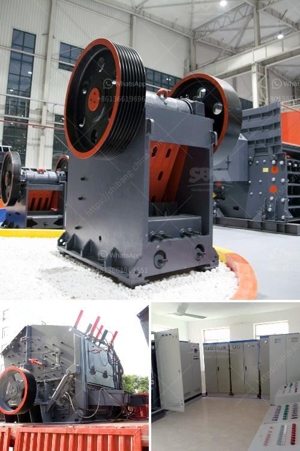

<h3>prices of stone crushers in philippines</h3>
The Philippines is one of the countries with abundant mineral resources in the world. It has rich mineral reserves, including gold, copper, iron, manganese, chromium, non-metallic minerals such as marble, limestone, clays, feldspar, phosphate rock, and silica. However, the mining industry is still in its infancy, with underdeveloped infrastructure and a lack of modern mining equipment.

One of the most vital pieces of machinery in the mining industry is the stone crusher. Stone crushers are used to break down rocks into smaller sizes and dust for further processing or for use in other industries. These machines are a staple in quarries and mines across the world, including the Philippines.

In recent years, the Philippines has witnessed a steady growth in the construction industry, prompting an increase in the demand for stone crushers. According to the Philippine Department of Trade and Industry, the construction industry generated approximately $8.6 billion in revenue in 2020, a significant increase from the previous year. This growth can be attributed to various factors such as infrastructure development, residential and commercial construction projects, and government investments.

As the demand for stone crushers in the Philippines continues to rise, so does its price. There are a lot of factors to consider when buying a stone crusher in the Philippines. Factors such as the size of the machine, its specifications, the built-in features, and its capacity all affect its price.

While there are certainly cheaper options available, they may not always be the most cost-effective in the long run. It is essential to invest in a high-quality stone crusher to ensure durability and efficiency. A well-built machine will require fewer repairs and replacements, resulting in lower maintenance costs.

The price of stone crushers in the Philippines depends on the specific model, capacity, and manufacturer. As mentioned, the price range can vary from a few thousand dollars to several million dollars. Some manufacturers offer machines with similar specifications at different prices, so it is advisable to compare and inquire about different models from various manufacturers before making a decision.

Another factor that affects the price of stone crushers in the Philippines is the capacity. This refers to how much rock the machine can handle per hour. Higher capacity machines tend to be more expensive but are also more productive and efficient. It is crucial to determine the required capacity based on the specific needs of the operation.

Besides the initial cost of purchasing the machine, it is also essential to consider the operational costs. This includes factors such as fuel consumption, electricity usage, and maintenance expenses. It is recommended to choose a stone crusher with low fuel consumption and energy-efficient features to minimize operational costs and ecological impact.

In conclusion, the prices of stone crushers in the Philippines vary depending on the specific needs and requirements of the buyer. With the increasing demand for stone crushers in the country, its price will continue to climb. Investing in a high-quality and durable machine will ensure that your operations run smoothly and efficiently, helping you save both time and money in the long run.
<h3>Contact us</h3><ul><li><strong>Whatsapp:&nbsp;<a href="https://wa.me/8613661969651">+8613661969651</a></strong></li><li><a href="https://swt.shibang-china.com/?git&amp;zhl&amp;prices of stone crushers in philippines"><strong>Online Service(chat now)</strong></a></li></ul><h3>Related</h3><ul><li><a href='komatsu crusher for sale in malaysia.md'>komatsu crusher for sale in malaysia</a></li><li><a href='industrial grinder fine powder.md'>industrial grinder fine powder</a></li><li><a href='free technical drawings ore hammer mill.md'>free technical drawings ore hammer mill</a></li><li><a href='stone crusher price list 300 tonnes capacity per hour.md'>stone crusher price list 300 tonnes capacity per hour</a></li><li><a href='rotary kilns in indonesia.md'>rotary kilns in indonesia</a></li></ul>