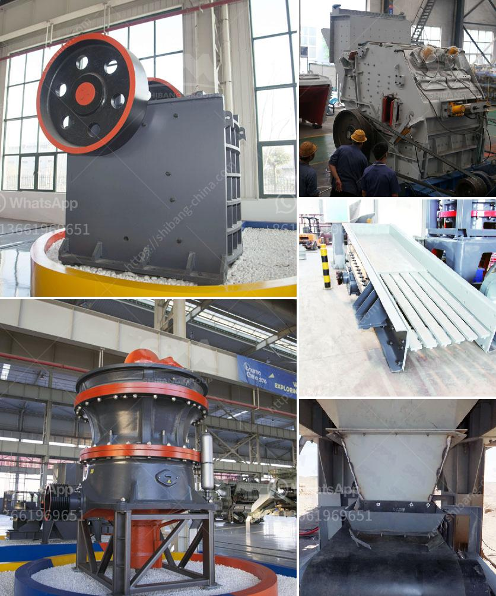

<h3>primary crusher for sale</h3>
A primary crusher is an important part of any construction and mining project. It is used to crush rocks into smaller particles. These machines are often used in quarries, construction sites, and mining operations. This allows the breaking down of larger rocks into smaller, more manageable sizes. However, finding a reliable primary crusher for sale can be a challenge. To help you navigate through the process, this article will discuss the features to look for and the benefits of buying a primary crusher.

When searching for a primary crusher for sale, it is essential to consider several factors. The first factor is the level of production you require. Determine the amount of material you need to process each day to meet your project's specifications. This will help you determine the capacity and strength requirements of the crusher. Additionally, consider the type of material you will be crushing. Different materials may require specific types of crushers. For example, crushing hard rock might require a different type of crusher compared to crushing soft limestone.

Another crucial factor to consider is the size and weight of the primary crusher. Ensure that the crusher can be easily transported to your project site. If the crusher is too heavy or large, it may be challenging to move it around, especially if you need to relocate it frequently. Additionally, consider the power source for the crusher. Determine whether it requires electricity or can be powered by other means, such as a diesel generator.

One popular type of primary crusher is a jaw crusher. Jaw crushers are commonly used in construction and mining applications due to their durability and versatility. They are capable of crushing various types of materials, including hard rocks and ores. Jaw crushers consist of a fixed jaw and a movable jaw. The movable jaw exerts force against the fixed jaw, crushing the material in between. This process produces smaller-sized particles that can be further processed or used as-is.

Benefits of buying a primary crusher for sale include increased efficiency and productivity. By crushing rocks into smaller particles, you can more easily extract valuable minerals or repurpose the material for construction projects. Additionally, utilizing a primary crusher can help reduce the amount of material that needs to be transported, leading to cost savings and a more sustainable operation.

Furthermore, investing in a reliable primary crusher can provide long-term cost savings. High-quality crushers are built to last and require minimal maintenance. This reduces the risk of unexpected breakdowns and downtime, ultimately increasing the overall efficiency of your operation and lowering operating costs.

In conclusion, finding a reliable primary crusher for sale is essential for any construction or mining project. Consider the capacity, type of material, size, and weight of the crusher when making your decision. Additionally, prioritize durability, efficiency, and ease of maintenance to ensure a successful and cost-effective investment. By choosing the right primary crusher, you can enhance your operation's productivity and efficiency while reducing overall costs.
<h3>Contact us</h3><ul><li><strong>Whatsapp:&nbsp;<a href="https://wa.me/8613661969651">+8613661969651</a></strong></li><li><a href="https://swt.shibang-china.com/?git&amp;zhl&amp;primary crusher for sale"><strong>Online Service(chat now)</strong></a></li></ul><h3>Related</h3><ul><li><a href='price of stone crusher size.md'>price of stone crusher size</a></li><li><a href='stone quarry companies in ghana.md'>stone quarry companies in ghana</a></li><li><a href='mill crusher pigment manufacturer in kenya.md'>mill crusher pigment manufacturer in kenya</a></li><li><a href='small 100 ton rock crushing machine.md'>small 100 ton rock crushing machine</a></li><li><a href='how stone crusher works.md'>how stone crusher works</a></li></ul>