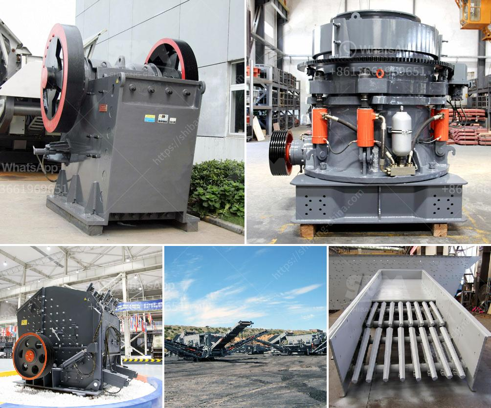

<h3>primary crusher machine</h3>
In the mining industry, crushing is crucial process, which is responsible for breaking down the materials into smaller pieces for further use. Crushing and screening machines are used among various industries, including mining, agriculture, pharmaceutical, food, and chemical. Among the crushing machines, the primary crusher is one of the most common and efficient ones.

The primary crusher machine is essential in any mining or quarrying operation. It is the machine that allows the raw material to be processed or run through the crushing cycle of a mining project. With its double toggle jaws, a primary crusher is capable of crushing a variety of materials, including rocks, gravel, and concrete. They are designed to withstand high tonnages and to have rugged construction.

So, what does a primary crusher machine do exactly? Its main job is to reduce the size of the raw material into smaller pieces. This reduction is important, as it allows for efficient transportation and processing of materials. The primary crusher machine achieves this task by applying force and pressure to the material. It utilizes a fixed and moving jaw plate, which are placed between two metal plates. The material is inserted into the gap between the two plates and is gradually crushed as the plates move closer together.

An effective primary crusher machine offers several benefits to mining companies. Firstly, it allows for greater efficiency in transportation, as smaller size materials are easier to handle and transport. In addition, smaller size materials also result in improved processing. This is because smaller materials can be processed more easily and efficiently, reducing the need for additional crushing or grinding equipment.

Furthermore, using a primary crusher machine ensures the proper sorting and separation of different materials. It segregates the materials based on their size, making it easier to process and utilize them in various ways. For example, if the desired end product is a specific size range, the primary crusher machine can be set accordingly to achieve the desired output.

It is worth noting that the primary crusher machine plays a significant role in the overall efficiency and productivity of a mining operation. Without an effective primary crusher, materials may need to undergo multiple crushing stages, resulting in increased energy consumption and excessive wear and tear on equipment. Additionally, it can lead to higher production costs and longer processing times.

To conclude, the primary crusher machine is an essential piece of equipment in the mining industry. Its main purpose is to reduce the size of raw materials, making them easier to handle, transport, and process. By efficiently breaking down materials, the primary crusher contributes to improved productivity, reduced production costs, and overall enhanced efficiency. Therefore, investing in a reliable and efficient primary crusher machine is crucial for any mining or quarrying operation.
<h3>Contact us</h3><ul><li><strong>Whatsapp:&nbsp;<a href="https://wa.me/8613661969651">+8613661969651</a></strong></li><li><a href="https://swt.shibang-china.com/?git&amp;zhl&amp;primary crusher machine"><strong>Online Service(chat now)</strong></a></li></ul><h3>Related</h3><ul><li><a href='coal washing process yotube.md'>coal washing process yotube</a></li><li><a href='crusher machine suppliers.md'>crusher machine suppliers</a></li><li><a href='crusher hydroponic cone crusher.md'>crusher hydroponic cone crusher</a></li><li><a href='stone crusher mills in mercadolibre.md'>stone crusher mills in mercadolibre</a></li><li><a href='grinding mill prices in south africa.md'>grinding mill prices in south africa</a></li></ul>