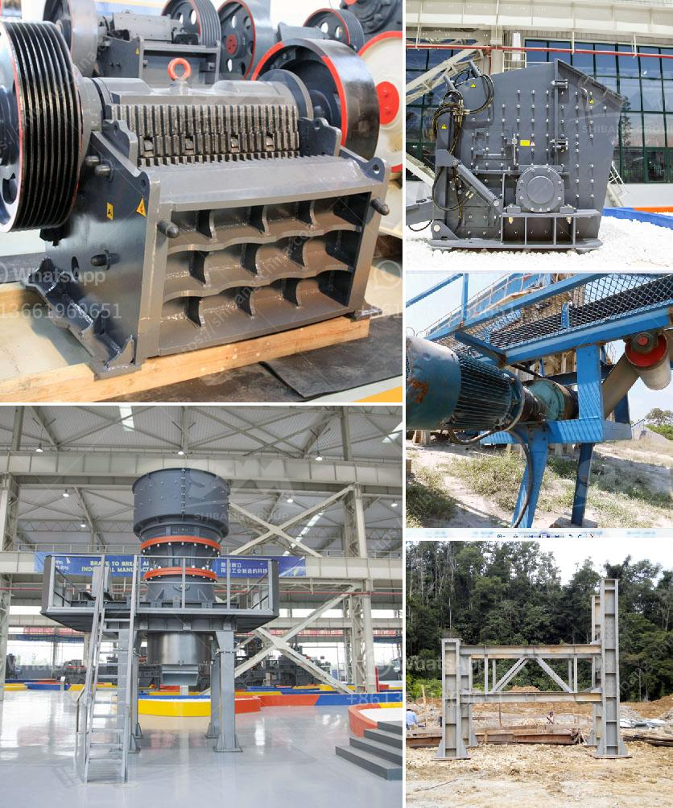

<h3>process of crushing granite</h3>
The crushing of granite is a process that involves three stages: primary, secondary, and tertiary crushing. As the name implies, these stages involve crushing the granite rock into smaller and finer pieces. Each stage has different crushing requirements, which are determined by the hardness and size of the rocks.

In the primary crushing stage, the granite stone extracted from the quarry is fed into a jaw crusher. This primary crushing process breaks the rock down to a manageable size. The rock is then transferred to a vibrating screen where its size is analyzed. If it meets the required size, it is sent to a secondary crusher. However, if the rock is too large, it is returned to the primary crusher for further processing.

The secondary crushing stage involves the use of a cone crusher. Here, the crushed granite is further reduced in size and given its final shape. This stage is crucial to ensuring the quality of the crushed granite, as it determines the final product's size and shape.

Once the granite rock has been processed through the secondary crushing stage, it proceeds to the tertiary crushing stage. In this stage, the granite is crushed into even finer pieces, typically using a vertical shaft impactor (VSI) crusher. The VSI crusher uses a rotating impeller to accelerate the rock against a crushing chamber's walls, breaking it down into smaller particles.

Throughout the entire crushing process, various screens and conveyors are used to transfer the crushed granite from one stage to another. These help ensure that the material is processed efficiently and consistently.

The crushing of granite is a time-consuming and labor-intensive process. However, it is essential for producing high-quality crushed granite that is used in various construction and infrastructure projects. It is particularly sought after for its durability, strength, and aesthetic qualities.

Granite's unique qualities make it suitable for various applications, including road construction, concrete production, landscaping, and architectural designs. Crushed granite is often used as a base material for driveways, pathways, and patio installations. Its durability and compression resistance also make it an ideal choice for building foundations and structures.

Moreover, crushed granite is highly valued for its aesthetic appeal. Its natural beauty and color variations make it a popular choice for decorative applications, such as garden pathways, retaining walls, and monuments.

In conclusion, the process of crushing granite involves three stages: primary, secondary, and tertiary crushing. Each stage plays a crucial role in reducing the size of the granite rock and shaping it into the desired form. The crushed granite is then used for various construction and decorative applications, thanks to its durability, strength, and aesthetic qualities.
<h3>Contact us</h3><ul><li><strong>Whatsapp:&nbsp;<a href="https://wa.me/8613661969651">+8613661969651</a></strong></li><li><a href="https://swt.shibang-china.com/?git&amp;zhl&amp;process of crushing granite"><strong>Online Service(chat now)</strong></a></li></ul><h3>Related</h3><ul><li><a href='coal mining machinery used.md'>coal mining machinery used</a></li><li><a href='quarry crusher business in south africa.md'>quarry crusher business in south africa</a></li><li><a href='limestone gypsum crusher machine.md'>limestone gypsum crusher machine</a></li><li><a href='cone crusher for sale nigeria.md'>cone crusher for sale nigeria</a></li><li><a href='stone crusher seller.md'>stone crusher seller</a></li></ul>