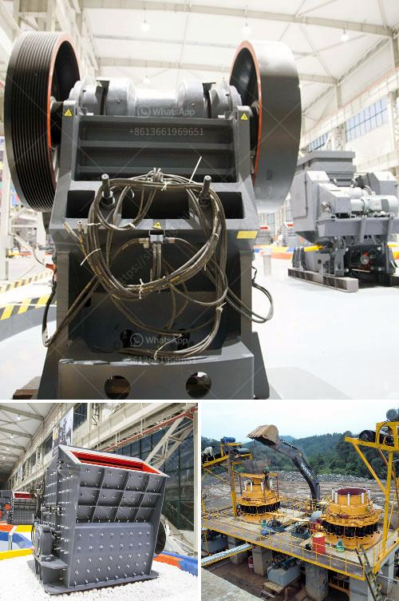

<h3>process of crushing rock in aggregate</h3>
The process of crushing rock in aggregate involves several stages and equipment. The first step is primary crushing, which is performed by a gyratory or jaw crusher. This reduces the rock to a manageable size suitable for further processing.

Next, the secondary crushing stage begins. This is usually done by a cone or impact crusher. The goal is to further reduce the size of the rock and create a more uniform shape. The crushed material is then screened to separate the desired product size from the oversize particles. The oversize material, often called "scrap," is sent back to the crusher for re-crushing.

After secondary crushing, the crushed rock is conveyed to vibrating screens. These screens separate the different sizes of material into specific fractions. This is crucial because aggregate products typically require different sizes for various construction purposes, such as making concrete or asphalt.

The separated fractions are then transported to storage bins or stockpiles using conveyors or loaders. The different sizes of aggregate can be stored separately to meet the specific needs of customers or construction projects.

To ensure the quality of the final product, it is common to wash the aggregate. Various methods, such as spray bars or bucket wheels, can be used to remove dirt, dust, and other impurities from the rock. Washing can also help to achieve the desired gradation by further separating different-sized particles.

Once the aggregate is clean, it is often transported to a crushing plant for further processing. At the crushing plant, the final product is produced by crushing the aggregate again, often with different crushers and configurations. Recirculating the material through multiple stages of crushing can enhance the overall quality and shape of the final product.

After the final crushing stage, the aggregate is ready for use. Whether it is used in construction projects, road building, or in concrete and asphalt production, the quality of the aggregate is crucial. This is why the entire crushing process – from primary crushing to final processing – needs to be carefully planned and executed.

Additionally, proper maintenance of the crushing equipment is essential for efficient and safe production. Regular inspection, cleaning, and lubrication of the crushers can help prevent breakdowns and extend their lifespan. Furthermore, using the right wear parts and maintaining proper settings can also optimize the crushing process and maximize the output of high-quality aggregate.

In conclusion, the process of crushing rock in aggregate is crucial for producing high-quality materials used in construction projects. It involves primary crushing, secondary crushing, screening, washing, and further processing. Quality control and proper maintenance of the equipment are essential to ensure the desired product size, shape, and gradation. By carefully managing the entire crushing process, manufacturers can meet the specific needs of their customers and provide reliable aggregate for various applications.
<h3>Contact us</h3><ul><li><strong>Whatsapp:&nbsp;<a href="https://wa.me/8613661969651">+8613661969651</a></strong></li><li><a href="https://swt.shibang-china.com/?git&amp;zhl&amp;process of crushing rock in aggregate"><strong>Online Service(chat now)</strong></a></li></ul><h3>Related</h3><ul><li><a href='cost of setting a sand crushing plant in india.md'>cost of setting a sand crushing plant in india</a></li><li><a href='vertical vertical roller mill.md'>vertical vertical roller mill</a></li><li><a href='manufacturing of talcum powder.md'>manufacturing of talcum powder</a></li><li><a href='roller grinding machines for sale.md'>roller grinding machines for sale</a></li><li><a href='impact crusher for sale in turkey.md'>impact crusher for sale in turkey</a></li></ul>