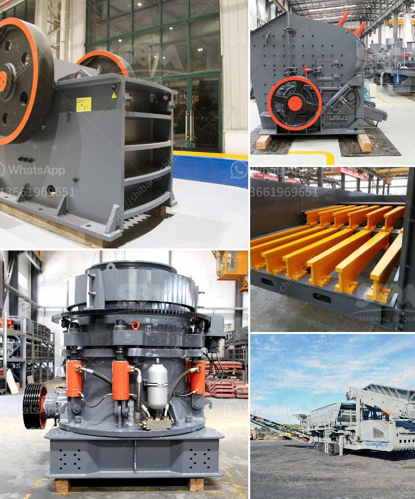

<h3>process of raw mill</h3>
The raw mill plays a crucial role in the production of cement as it converts limestone and clay into clinker. The process of raw mill in cement industry consists of various stages, each designed to yield the desired clinker quality.

In the initial stage of the process, raw materials are extracted from the quarry and transported to the crushing plant. Here, the limestone and clay are crushed into smaller pieces and then conveyed to the raw mill for further grinding.

The grinding process in the raw mill is carried out in a closed circuit, where simultaneously drying of the material takes place. The raw feed enters the mill from the feed chute and is transferred to the grinding table, where it is ground between the table and the rollers. The grinding process reduces the particle size of the raw materials, allowing for better blending of different materials and enhancing the reactivity of the mixture.

To optimize the grinding process and ensure consistent quality of the clinker produced, the raw mill is equipped with various control systems. These systems monitor the feed rate, temperature, and pressure inside the mill, allowing operators to adjust the parameters accordingly. These controls are critical to maintaining stable and efficient operation of the mill.

Once the raw materials are ground to the desired fineness, they are transported to the kiln for further processing. The ground material, also known as raw meal, is mixed with water to form a slurry. This slurry is then heated in the kiln to a temperature of around 1450 degrees Celsius, causing the chemical reactions that transform it into clinker.

The efficiency of the raw mill directly affects the overall efficiency of the cement manufacturing process. Proper operation of the mill requires regular maintenance and inspection to ensure that all components are functioning properly. The wear and tear of the grinding elements, such as the grinding table and rollers, must be monitored and replaced when necessary to maintain optimal performance.

Furthermore, the raw mill is often subject to fluctuations in the feed composition and moisture content, which can impact the grinding efficiency. To address these challenges, advanced control strategies are employed, such as feedforward and feedback control, to maintain stable operation and achieve desired clinker quality.

In conclusion, the raw mill is an essential component in the cement manufacturing process. It grinds and blends limestone and clay to produce raw meal, which is then heated in the kiln to produce clinker. The proper operation and maintenance of the raw mill are crucial to the overall efficiency and quality of the cement production. Through advanced control systems and monitoring techniques, operators can ensure stable operation and optimize the grinding process.
<h3>Contact us</h3><ul><li><strong>Whatsapp:&nbsp;<a href="https://wa.me/8613661969651">+8613661969651</a></strong></li><li><a href="https://swt.shibang-china.com/?git&amp;zhl&amp;process of raw mill"><strong>Online Service(chat now)</strong></a></li></ul><h3>Related</h3><ul><li><a href='mobile stone crusher for sale philippines.md'>mobile stone crusher for sale philippines</a></li><li><a href='dicalcium phosphate process hydrochloric acid flow chart.md'>dicalcium phosphate process hydrochloric acid flow chart</a></li><li><a href='drums for conveyor belts.md'>drums for conveyor belts</a></li><li><a href='nigeria rock crusher for sale.md'>nigeria rock crusher for sale</a></li><li><a href='gold stone crusher images.md'>gold stone crusher images</a></li></ul>