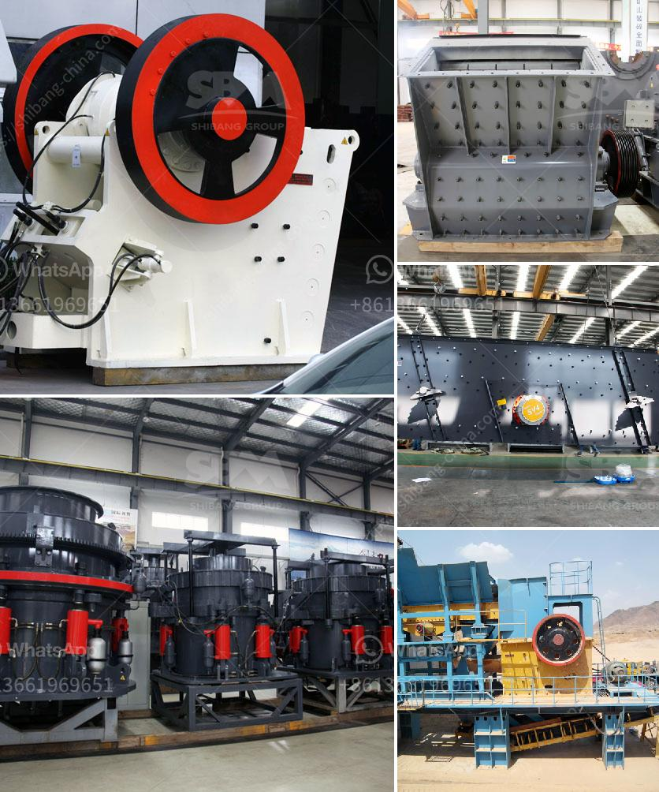

<h3>process of setting of a stone crusher in orissa</h3>
Setting up a stone crusher plant in Orissa can be a challenging task for many entrepreneurs. The process often involves several steps, including gathering necessary documents, submitting applications, securing land, obtaining environmental clearances, and finally, establishing a crushing unit. However, for a startup, the initial challenges may seem overwhelming. In this article, we will discuss the process of setting up a stone crusher plant in Orissa.

1. Land: A minimum land area of one acre is required for establishing a stone crusher plant. The land should be located in an area suitable for stone quarrying and crushing activities.

2. Environmental Clearances: Obtaining environmental clearances from the State Pollution Control Board (SPCB) is essential. The entrepreneur must submit an application along with necessary documents like site plan, layout, project report, and environmental impact assessment (EIA) report. This step is crucial to ensure compliance with environmental regulations and minimize the negative impact on the surrounding environment.

3. Documentations: The entrepreneur needs to submit several documents, such as proof of land ownership, identity proof, address proof, incorporation certificate (if applicable), and other relevant licenses. These documents are essential to establish the credibility of the project and the applicant.

4. Infrastructure: Setting up a stone crusher plant requires significant infrastructure, including machinery like crushers, screens, conveyors, and storage tanks. The entrepreneur needs to arrange for the necessary infrastructure either by purchasing or leasing the equipment.

5. Power Supply and Water: Adequate power supply and water availability are essential for running the stone crusher plant smoothly. The entrepreneur needs to ensure a reliable source of these utilities.

6. Manpower: Depending on the scale of operations, the entrepreneur needs to hire skilled and unskilled personnel for various tasks like operating the machinery, maintaining the plant, and handling administrative works. A systematic recruitment process needs to be followed to attract qualified personnel.

Once all the necessary requirements are fulfilled, the entrepreneur can proceed with the establishment of the stone crusher plant. The process involves the following steps:

1. Site Selection: Careful site selection is crucial to ensure the availability of raw materials, proximity to the market, and adherence to environmental regulations. The entrepreneur must survey various locations and choose a suitable site.

2. Land Acquisition: After finalizing the site, the entrepreneur needs to acquire the land by purchasing or leasing it from the respective authorities or individuals.

3. Infrastructure Setup: The entrepreneur needs to establish the necessary infrastructure, including building structures, machinery installations, utilities, and office spaces.

4. Obtaining Necessary Approvals: The entrepreneur must approach the concerned government bodies, including the local municipality, SPCB, and other relevant departments to obtain necessary approvals and clearances.

5. Commencement of Operations: Once all the approvals are obtained, the entrepreneur can start the operations of the stone crusher plant. Regular maintenance, proper waste management, and compliance with environmental regulations should be ensured to run the operations smoothly.

Setting up a stone crusher plant in Orissa requires meticulous planning, diligent execution, and adherence to various regulations and guidelines. The process can be time-consuming and challenging, but with determination and proper guidance, it is possible to set up a successful stone crusher plant in Orissa.
<h3>Contact us</h3><ul><li><strong>Whatsapp:&nbsp;<a href="https://wa.me/8613661969651">+8613661969651</a></strong></li><li><a href="https://swt.shibang-china.com/?git&amp;zhl&amp;process of setting of a stone crusher in orissa"><strong>Online Service(chat now)</strong></a></li></ul><h3>Related</h3><ul><li><a href='prices of stone crushers in philippines.md'>prices of stone crushers in philippines</a></li><li><a href='mobile crusher discount.md'>mobile crusher discount</a></li><li><a href='4 roller mill for stone.md'>4 roller mill for stone</a></li><li><a href='cobalt ore processing plant setup cost.md'>cobalt ore processing plant setup cost</a></li><li><a href='process of raw mill.md'>process of raw mill</a></li></ul>