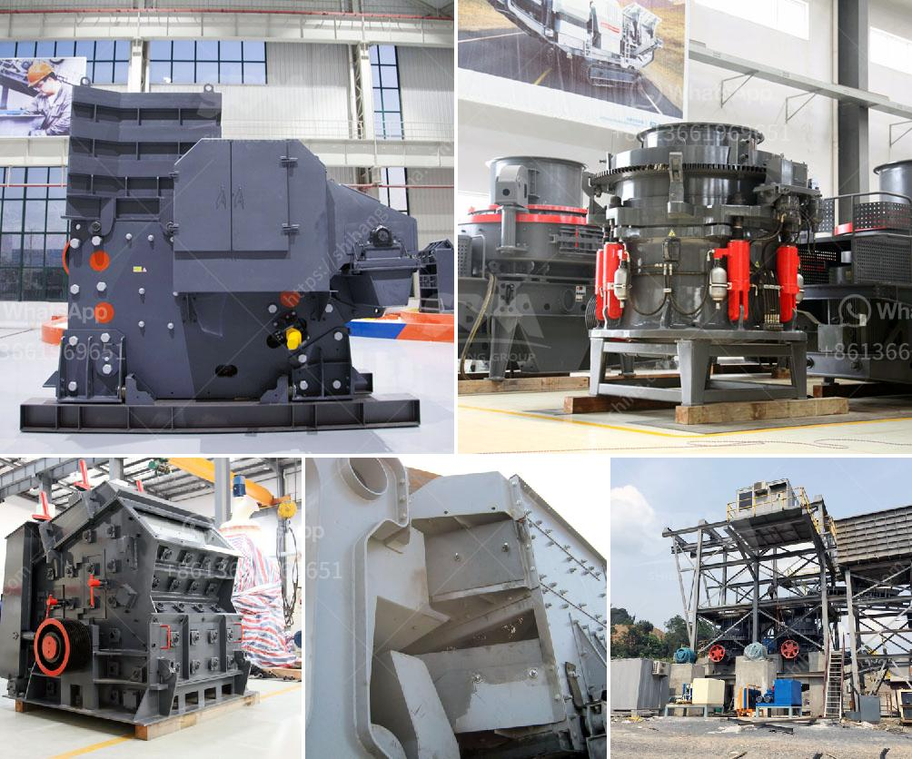

<h3>processing of platinum ore flow sheet</h3>
Platinum, a precious metal, is renowned for its durability, resistance to corrosion, and high melting point. It is widely used in various industries, including jewelry, automotive, electronics, and chemical sectors. However, extracting platinum from its ore can be a complex and intricate process. In this article, we will explore the flow sheet of processing platinum ore, highlighting the key steps involved.

The first step in the processing of platinum ore is crushing and grinding. The ore is crushed into small particles and ground to a fine powder, allowing for easier separation of the valuable platinum-bearing minerals from the gangue minerals.

After the initial crushing and grinding, the ore undergoes a process called froth flotation. This process exploits the differences in surface properties of the platinum-bearing minerals and the gangue minerals. In a flotation cell, a mixture of water, reagents, and air is introduced, creating a froth that carries the platinum-bearing minerals to the surface, while the gangue minerals sink to the bottom. The froth containing platinum minerals is then collected and skimmed off.

Once separated from the gangue minerals, the platinum-bearing minerals are further concentrated. This is achieved through a process called smelting. Smelting involves heating the concentrated platinum minerals in a furnace at high temperatures. This leads to the formation of a molten metal, which is then poured into molds to obtain platinum ingots.

However, the platinum obtained from smelting still contains impurities, such as iron and nickel. These impurities need to be removed through a refining process. Refining typically involves a combination of selective precipitation, filtration, and chemical treatments to separate the impurities from the platinum.

Once the platinum has been refined, it can be further processed to obtain various forms based on its intended use. For instance, if the platinum is destined for jewelry, it may undergo additional steps such as rolling, shaping, and polishing to produce the desired final product.

It is worth noting that the flow sheet for processing platinum ore can vary depending on the specific characteristics of the ore deposit. Factors such as the mineralogy of the ore, the desired grade and recovery of platinum, as well as economic considerations, play a significant role in determining the optimal processing route.

In conclusion, processing platinum ore is a multi-step and intricate process that involves crushing, grinding, froth flotation, smelting, refining, and further processing. Each step is vital in extracting and refining platinum, ensuring its purity and quality for various industrial applications. The flow sheet is tailored to the specific characteristics of the ore deposit, optimizing the efficiency and economics of the process. With the demand for platinum expected to continue growing, efficient and sustainable processing methods are crucial for meeting global demand while minimizing environmental impacts.
<h3>Contact us</h3><ul><li><strong>Whatsapp:&nbsp;<a href="https://wa.me/8613661969651">+8613661969651</a></strong></li><li><a href="https://swt.shibang-china.com/?git&amp;zhl&amp;processing of platinum ore flow sheet"><strong>Online Service(chat now)</strong></a></li></ul><h3>Related</h3><ul><li><a href='price conveyor belt price.md'>price conveyor belt price</a></li><li><a href='cost of silica sand mine equipment.md'>cost of silica sand mine equipment</a></li><li><a href='high capacity fine stone quarry crusher machine.md'>high capacity fine stone quarry crusher machine</a></li><li><a href='mobile crusher ghana.md'>mobile crusher ghana</a></li><li><a href='basalt crushing line.md'>basalt crushing line</a></li></ul>