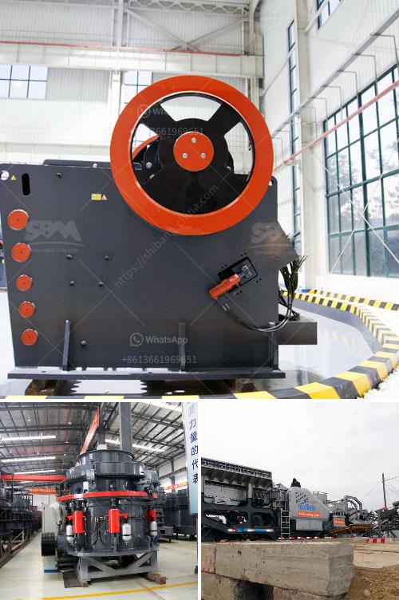

<h3>products pe jaw crusher</h3>
The PE jaw crusher is a highly efficient and energy-saving crushing equipment developed by the manufacturer based on years of experience in mining, quarrying, and mineral processing industries. It adopts the most advanced crushing technology and manufacturing process to meet the different needs of customers. With its outstanding performance, the PE jaw crusher has become the preferred equipment for crushing hard and strong materials.

The PE jaw crusher has a simple structure, reliable operation, and low operating costs. It is characterized by low noise during operation and less dust generation, making it ideal for crushing various materials with compressive strength not exceeding 320MPa. The machine has a wide range of applications in mining, smelting, building materials, highways, railways, water conservancy, chemical industries, and other fields.

The PE jaw crusher has a large crushing ratio, high production efficiency, and uniform product size. It allows the material to be crushed and discharged freely, which improves the utilization rate of the jaw plate and extends its service life. The movable jaw assembly adopts a high-quality steel casting structure, which ensures the reliability and durability of the equipment.

Furthermore, the PE jaw crusher is equipped with a deep crushing cavity and optimized crushing angle, which greatly improves the feeding capacity and output. This ensures that the materials are evenly crushed and the final product has a high quality and uniform particle size distribution. The adjustable discharge opening allows for flexible adjustment of the granularity, meeting the requirements of different users.

In addition, the PE jaw crusher is equipped with an overload protection device, which can effectively protect the equipment and ensure the safe operation. The lubrication system is also well designed to ensure the smooth operation of the machine and reduce maintenance costs. The machine is driven by a low-voltage, low-current motor, which further reduces energy consumption and saves operating costs.

Overall, the PE jaw crusher is a reliable and efficient crushing equipment that offers significant advantages in terms of performance and cost-effectiveness. Its advanced technology, high production efficiency, and low operating costs make it an ideal choice for crushing various hard and strong materials. Whether it is used in mining, quarrying, or other industries, the PE jaw crusher will deliver superior crushing performance and contribute to the success of the operation.
<h3>Contact us</h3><ul><li><strong>Whatsapp:&nbsp;<a href="https://wa.me/8613661969651">+8613661969651</a></strong></li><li><a href="https://swt.shibang-china.com/?git&amp;zhl&amp;products pe jaw crusher"><strong>Online Service(chat now)</strong></a></li></ul><h3>Related</h3><ul><li><a href='high efficient grinding mills for sale.md'>high efficient grinding mills for sale</a></li><li><a href='hammer mill dealer in cebu.md'>hammer mill dealer in cebu</a></li><li><a href='lm series vertical mill.md'>lm series vertical mill</a></li><li><a href='used floor grinding machines for sale.md'>used floor grinding machines for sale</a></li><li><a href='manufacturers crushing stone.md'>manufacturers crushing stone</a></li></ul>