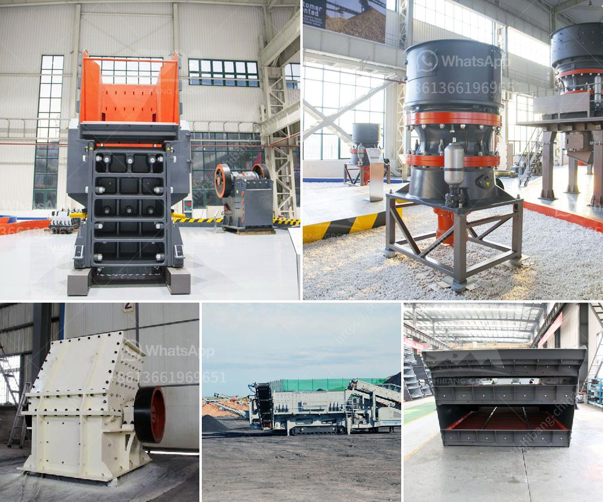

<h3>professional boulder crusher manufacturer</h3>
When it comes to the construction and mining industries, one crucial piece of equipment stands out - the boulder crusher. These powerful machines are designed to break down large rocks into smaller, more manageable sizes, making them essential for various projects. In this article, we will explore the importance of partnering with a professional boulder crusher manufacturer and the benefits it brings.

First and foremost, a professional boulder crusher manufacturer possesses the knowledge and expertise needed to produce high-quality equipment. They understand the specific requirements of different industries and are equipped with advanced technology to manufacture crushers that can withstand the toughest conditions. By investing in machinery from a reputable manufacturer, companies can ensure optimal performance and longevity for their boulder crusher.

Moreover, a professional boulder crusher manufacturer offers a wide range of crusher options to suit individual project requirements. Whether it's a primary crusher for large boulders or a smaller secondary crusher for finer crushing, they have the right solution. This versatility allows businesses to choose the most suitable equipment for their specific needs, enhancing overall productivity and efficiency.

Working with a professional manufacturer also ensures access to comprehensive aftersales support. From installation to maintenance and repairs, a reputable manufacturer will have a dedicated team of experts who can provide assistance and guidance throughout the crusher's lifespan. This reduces downtime and optimizes the functioning of the equipment.

Furthermore, a professional boulder crusher manufacturer is committed to safety and environmental standards. They design and produce crushers that prioritize operator safety and adhere to regulatory requirements. By investing in equipment from such a manufacturer, businesses can minimize risks and contribute to sustainable practices.

In conclusion, partnering with a professional boulder crusher manufacturer is essential for any construction or mining company. Their expertise, wide range of options, aftersales support, and commitment to safety make them the ideal choice for businesses seeking reliable and efficient boulder crushers. By choosing a reputable manufacturer, companies can ensure the success and profitability of their projects.
<h3>Contact us</h3><ul><li><strong>Whatsapp:&nbsp;<a href="https://wa.me/8613661969651">+8613661969651</a></strong></li><li><a href="https://swt.shibang-china.com/?git&amp;zhl&amp;professional boulder crusher manufacturer"><strong>Online Service(chat now)</strong></a></li></ul><h3>Related</h3><ul><li><a href='used crusher mobile for sale in uae.md'>used crusher mobile for sale in uae</a></li><li><a href='india copper mining equipment.md'>india copper mining equipment</a></li><li><a href='used raymond mills barite raymond mill.md'>used raymond mills barite raymond mill</a></li><li><a href='gold mining machinery.md'>gold mining machinery</a></li><li><a href='quartz cobble making machines in india.md'>quartz cobble making machines in india</a></li></ul>