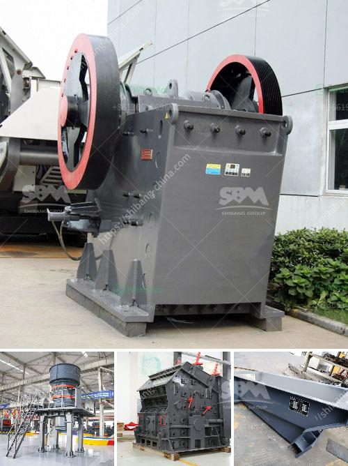

<h3>project cost of mini cement plant in india</h3>
Mini cement plant is a new project in the cement industry that aims to produce cement, such as Portland cement, without the need for large-scale infrastructure and construction capabilities. It aims to reduce the cost of production and cement the gap between supply and demand in the country.

India is one of the largest cement producers in the world, and the demand for cement is constantly growing due to the country's rapid urbanization and infrastructure development. However, the cost of setting up a cement plant can be quite high, making it a barrier for many small and medium-sized entrepreneurs.

The cost of a mini cement plant in India varies depending on various factors, such as the type and capacity of the plant, location, fuel type, raw material availability, machinery requirements, and labor costs. These factors impact the project cost and ultimately determine the feasibility of setting up a mini cement plant.

To give a rough estimate, a mini cement plant with a capacity of 50-100 tons per day can range from INR 25-50 crores ($3.4-6.8 million). This includes the cost of land, building, machinery, and equipment. The cost increases with the capacity of the plant, and a plant with a capacity of 200-300 tons per day can cost anywhere between INR 60-100 crores ($8-13.6 million).

The location of the mini cement plant is crucial in determining the project cost. The availability of raw materials, such as limestone and clay, in close proximity, reduces transportation costs. Similarly, the availability of power and water supply is essential for the plant's operations and can impact the cost significantly.

The choice of fuel type is another important consideration. While most cement plants in India use coal as the primary fuel, alternative fuels such as biomass, municipal solid waste, and pet coke can be used to reduce fuel costs and environmental impact. However, the availability and cost of these alternative fuels need to be taken into account during the project cost estimation.

Machinery requirements for a mini cement plant include crushers, kilns, mills, and packing units. The cost of machinery can vary significantly depending on the quality and capacity of the equipment. Additionally, the cost of spare parts and maintenance should be considered for long-term sustainability.

Labor costs can also have a substantial impact on the project cost. India has relatively low labor costs compared to other countries, but it can vary depending on the region and availability of skilled manpower. Hiring skilled workers and properly training them is crucial for the smooth functioning and efficient operation of the mini cement plant.

In conclusion, setting up a mini cement plant in India requires careful planning and consideration of various factors that influence the project cost. Although the initial investment may appear significant, the long-term benefits, such as reduced production costs and increased profitability, make it an attractive option for entrepreneurs looking to enter the cement industry. Additionally, initiatives by the government to promote infrastructure development provide a favorable environment for the growth of mini cement plants in the country.
<h3>Contact us</h3><ul><li><strong>Whatsapp:&nbsp;<a href="https://wa.me/8613661969651">+8613661969651</a></strong></li><li><a href="https://swt.shibang-china.com/?git&amp;zhl&amp;project cost of mini cement plant in india"><strong>Online Service(chat now)</strong></a></li></ul><h3>Related</h3><ul><li><a href='used stone crushing plant for sale in spain.md'>used stone crushing plant for sale in spain</a></li><li><a href='alluvial chrome wash plant in zimbabwe.md'>alluvial chrome wash plant in zimbabwe</a></li><li><a href='nigeria cone crusher photos.md'>nigeria cone crusher photos</a></li><li><a href='specification jaw crusher.md'>specification jaw crusher</a></li><li><a href='mobile crushers for sale in nigeria.md'>mobile crushers for sale in nigeria</a></li></ul>