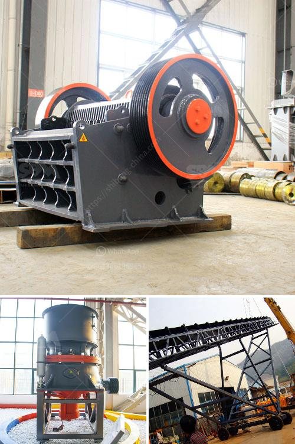

<h3>project report on quartz industries</h3>
Quartz is a mineral composed of silicon and oxygen atoms, making it one of the most abundant minerals on Earth's continental crust. It has a wide range of applications due to its unique properties, including its ability to resist high temperatures and its hardness. The quartz industry encompasses various sectors, including mining, manufacturing, and fabrication, which contribute to the production and commercialization of quartz-based products. This project report aims to provide an overview of the quartz industries and the potential opportunities and challenges associated with them.

The first step in the quartz industry value chain is mining and extraction. Quartz deposits usually occur in igneous, metamorphic, and sedimentary rocks. To extract quartz from these rock formations, different mining techniques are employed. Open-pit mining is commonly used for large-scale operations, while underground mining is utilized for deeper deposits. The extracted quartz undergoes a series of processes, including crushing, grinding, and separation, to obtain the desired mineral purity.

After extraction, the quartz is transported to manufacturing and fabrication facilities. Here, the raw quartz is transformed into various products through different techniques. One of the most common manufacturing processes is the production of quartz slabs. This involves combining crushed quartz with binding resins and pigments and then subjecting the mixture to high heat and pressure to create large slabs. These slabs are widely used in kitchens, bathrooms, and other surfaces, providing durability, resistance, and aesthetic appeal.

The quartz industry serves a wide range of applications across sectors such as construction, electronics, and optics. Its high thermal and chemical resistance make it ideal for use in the manufacturing of semiconductors, optical lenses, and crucibles. Additionally, its decorative and versatile characteristics have led to its widespread use in interior design, as countertops, flooring, and wall coverings.

The global quartz industry has experienced significant growth in recent years, driven by increasing construction activities and the growing demand for electronics and consumer goods. The market's expansion is also attributed to the rising awareness among consumers about the benefits of quartz products, such as their durability, resistance to stains, and easy maintenance.

Despite the promising growth prospects, the quartz industry faces several challenges. One of the main concerns is the environmental impact of mining and processing operations. The extraction of quartz can result in habitat destruction, soil erosion, and water pollution if not carried out responsibly. Moreover, the manufacturing process emits greenhouse gases, particularly during the production of quartz slabs. To mitigate these issues, companies are focusing on adopting sustainable practices such as implementing reclamation plans, optimizing energy usage, and reducing waste generation.

Another challenge is the competition from alternative materials, such as granite, marble, and engineered quartz. These materials offer similar characteristics to quartz and are also popular choices among consumers. To remain competitive, quartz industries need to continuously innovate and differentiate their products by offering unique designs, improved durability, and eco-friendly features.

The quartz industry plays a crucial role in multiple sectors, providing essential materials for construction, electronics, and interior design. The growing demand for quartz-based products presents significant opportunities for expansion. However, companies must address environmental concerns, adopt sustainable practices, and embrace innovation to retain their competitive edge. With the right strategies and continuous improvement, the quartz industry can thrive and contribute to the positive growth of various sectors worldwide.
<h3>Contact us</h3><ul><li><strong>Whatsapp:&nbsp;<a href="https://wa.me/8613661969651">+8613661969651</a></strong></li><li><a href="https://swt.shibang-china.com/?git&amp;zhl&amp;project report on quartz industries"><strong>Online Service(chat now)</strong></a></li></ul><h3>Related</h3><ul><li><a href='fly ash powder making.md'>fly ash powder making</a></li><li><a href='quartz crushing process.md'>quartz crushing process</a></li><li><a href='concrete crusher for rent in toronto.md'>concrete crusher for rent in toronto</a></li><li><a href='ball mill procedure in practical.md'>ball mill procedure in practical</a></li><li><a href='small concrete crusher used.md'>small concrete crusher used</a></li></ul>