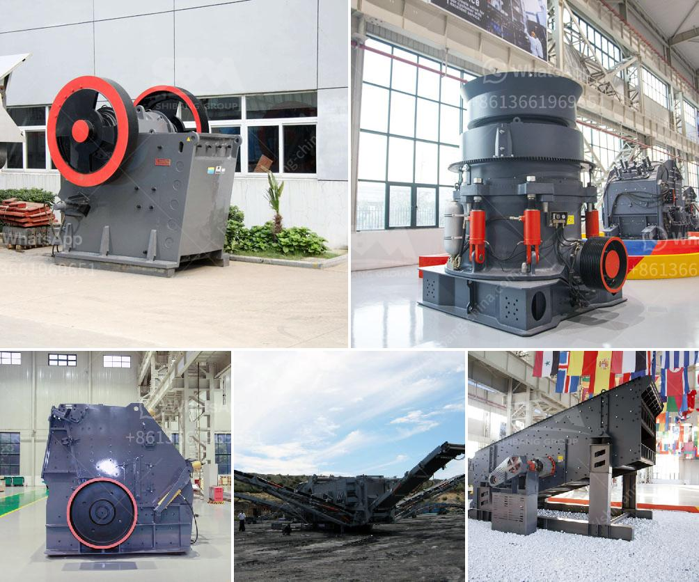

<h3>pulverized ball mills</h3>
Pulverized ball mills are a type of grinding equipment commonly used in industrial applications. They are used to grind materials into fine powders, such as coal, iron ore, ceramics, and paints. The concept of pulverizing materials through ball mills has been around for centuries, but it was not until the industrial revolution and the development of new materials that pulverized ball mills became more widely used.

Pulverized ball mills work by rotating a cylinder containing steel balls, which grind the material as they tumble within the cylinder. The grinding action of the balls helps to reduce the size of the material, resulting in a fine powder. The size of the grinding balls and the speed of the mill can be adjusted to achieve the desired particle size and grind time.

One of the advantages of using pulverized ball mills is their versatility. They can be used for both wet and dry grinding, allowing manufacturers to process a wide range of materials. Additionally, the fine powders produced by these mills have a high surface area, making them ideal for applications that require high reactivity or rapid dissolution.

In many industries, pulverized ball mills are essential for producing materials used in critical processes. For example, in the cement industry, pulverized ball mills are used to grind clinker, a component used to produce cement. In the pharmaceutical industry, these mills are used to grind active pharmaceutical ingredients (APIs) into fine powders, which are then used to create medicines.

However, despite their many advantages, there are some limitations to using pulverized ball mills. For example, they can be very energy-intensive, requiring significant amounts of electricity to operate. Additionally, the grinding balls can wear out over time, requiring regular maintenance and replacement.

In conclusion, pulverized ball mills are an important tool in many industries for grinding materials into fine powders. Their versatility and ability to produce high-quality powders make them a valuable asset for manufacturers. However, it is important to consider the energy consumption and maintenance requirements associated with these mills when choosing to use them in an industrial setting.
<h3>Contact us</h3><ul><li><strong>Whatsapp:&nbsp;<a href="https://wa.me/8613661969651">+8613661969651</a></strong></li><li><a href="https://swt.shibang-china.com/?git&amp;zhl&amp;pulverized ball mills"><strong>Online Service(chat now)</strong></a></li></ul><h3>Related</h3><ul><li><a href='barite crushing machine.md'>barite crushing machine</a></li><li><a href='100 tph stone crusher price.md'>100 tph stone crusher price</a></li><li><a href='south africa mining law on crusher.md'>south africa mining law on crusher</a></li><li><a href='jual mesin raymond mill.md'>jual mesin raymond mill</a></li><li><a href='type of stone crushers.md'>type of stone crushers</a></li></ul>