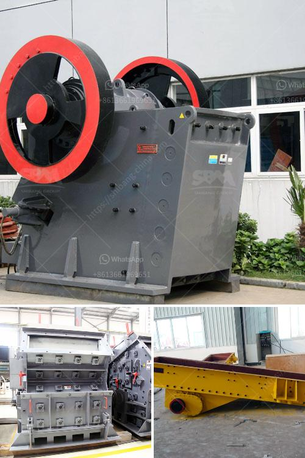

<h3>pulverizer crusher machine manufacturers south africa</h3>
South Africa is a country known for its diverse mineral resources. With a rich history of mining industries, it has been a forefront player in shaping the global mining industry. As a result, pulverizer crusher machine manufacturers are expanding their export capabilities and extensive investing in this lucrative market to harness its potential.

A pulverizer crusher machine is a mechanical equipment that is used for grinding various types of materials. Such machines are used for a wide range of applications ranging from recycling and construction waste management to the mining and quarrying industries. The increasing demand for pulverizers in South Africa can be attributed to the growing industrialization and urbanization, which has led to an exponential increase in the production of various materials and a need for efficient crushing and grinding technologies.

One of the leading pulverizer crusher machine manufacturers in South Africa is Osborn. This company offers a wide range of crushing and screening solutions for mineral processing, aggregate, construction, and mining industries. With a history of more than 100 years, Osborn has been able to establish itself as a trusted and reliable brand in the market.

Osborn's offerings include single and double-toggle jaw crushers, cone crushers, vertical shaft impactors, and screens. These machines are designed to handle a wide range of materials, from soft to hard and abrasive. Osborn's crushers are known for their durability, reliability, and efficiency, making them ideal for the demanding conditions of the South African mining industry.

In addition to Osborn, other notable pulverizer crusher machine manufacturers in South Africa include Pilot Crushtec, Metso, and Bell Equipment. These companies offer a variety of crushing solutions that cater to different industries and applications. With a focus on innovation and customer satisfaction, these manufacturers are constantly improving their products to meet the evolving needs of the market.

Furthermore, the South African government's commitment to promoting the mining and quarrying industry has provided a conducive environment for pulverizer crusher machine manufacturers. The government has implemented policies and incentives to attract foreign investment and support local industries. This has resulted in increased collaboration between international manufacturers and South African companies, leading to the development of advanced and efficient crushing technologies.

In conclusion, the pulverizer crusher machine industry in South Africa is witnessing significant growth due to the increasing demand for efficient crushing and grinding technologies. Pulverizer crusher machine manufacturers, such as Osborn, Pilot Crushtec, Metso, and Bell Equipment, are expanding their offerings and investing in the South African market to cater to the diverse needs of industries such as mining, construction, and recycling. With a focus on innovation, quality, and customer satisfaction, these manufacturers are poised to play a crucial role in shaping the future of the pulverizer crusher machine market in South Africa.
<h3>Contact us</h3><ul><li><strong>Whatsapp:&nbsp;<a href="https://wa.me/8613661969651">+8613661969651</a></strong></li><li><a href="https://swt.shibang-china.com/?git&amp;zhl&amp;pulverizer crusher machine manufacturers south africa"><strong>Online Service(chat now)</strong></a></li></ul><h3>Related</h3><ul><li><a href='stone crushing plant 100tph for sale.md'>stone crushing plant 100tph for sale</a></li><li><a href='quarry machinery manufacturers.md'>quarry machinery manufacturers</a></li><li><a href='mobile crusher plant price in india.md'>mobile crusher plant price in india</a></li><li><a href='crushing rock aggregate machinery.md'>crushing rock aggregate machinery</a></li><li><a href='nigeria cone crusher photos.md'>nigeria cone crusher photos</a></li></ul>