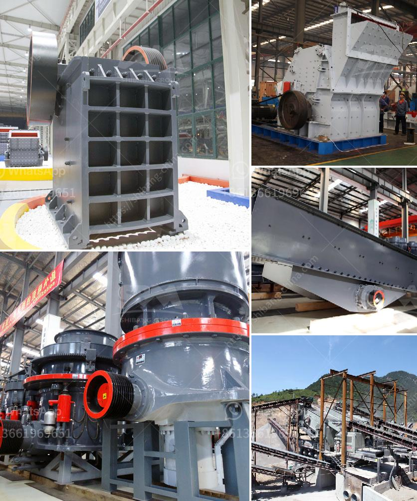

<h3>pulverizer for carbon black</h3>
Carbon black is a highly sought-after substance produced by the incomplete combustion of petroleum products. Its fine black powder consists mainly of elemental carbon and serves various industrial applications, including the production of tires, plastics, and printing inks. However, the manufacturing and disposal processes associated with carbon black raise environmental concerns, making the need for sustainable solutions vital.

One significant challenge for carbon black manufacturers is the proper disposal of waste materials generated during production. These wastes not only have a negative impact on the environment but also represent a loss of valuable resources. In recent years, pulverizers specifically designed for carbon black have emerged as an efficient and sustainable solution for waste management.

A pulverizer is a mechanical device used to grind, crush, or pulverize various materials into smaller particles. Traditionally, pulverizers have been utilized in many industries to process minerals, chemicals, and food products. However, the development of specialized pulverizers has paved the way for transforming carbon black waste into a valuable resource.

The primary function of a pulverizer for carbon black is to reduce the size of carbon black particles, making them more manageable for storage, transportation, and further processing. By grinding the waste carbon black into a fine powder, it becomes easier to mix it with other materials or incorporate it into various manufacturing processes.

One major advantage of using pulverizers for carbon black waste management is the environmental benefits it offers. By repurposing the waste material, manufacturers can significantly reduce the amount of carbon black being sent to landfills or incinerated. This reduction in waste helps minimize the release of harmful greenhouse gases and substantially lowers the overall carbon footprint of the manufacturing process.

Moreover, utilizing pulverizers for carbon black fosters a more sustainable approach to resource management. Instead of relying solely on the extraction of new carbon black materials, manufacturers can tap into the reserves of waste carbon black, conserving natural resources and reducing the need for new production. This shift aligns with the principles of the circular economy, where waste is considered a valuable resource that can be reintegrated back into the production cycle.

In addition to the environmental and resource management benefits, the use of pulverizers for carbon black waste also presents economic advantages. By repurposing waste materials, manufacturers can decrease their reliance on expensive virgin carbon black, leading to cost savings. Furthermore, the high-quality pulverized carbon black can be sold to other industries, creating additional revenue streams for carbon black producers.

In conclusion, the development of pulverizers specifically designed for handling carbon black waste represents a significant step towards sustainability in the manufacturing industry. These pulverizers not only alleviate the environmental impact caused by the disposal of waste materials but also allow for the repurposing of valuable resources. By adopting pulverizers for carbon black waste management, manufacturers can reduce their carbon footprint, conserve natural resources, and generate economic benefits. As they gain more popularity, pulverizers for carbon black will likely become an integral component of waste management strategies across various industries, contributing to a greener and more sustainable future.
<h3>Contact us</h3><ul><li><strong>Whatsapp:&nbsp;<a href="https://wa.me/8613661969651">+8613661969651</a></strong></li><li><a href="https://swt.shibang-china.com/?git&amp;zhl&amp;pulverizer for carbon black"><strong>Online Service(chat now)</strong></a></li></ul><h3>Related</h3><ul><li><a href='mobile crusher in saudi arabia.md'>mobile crusher in saudi arabia</a></li><li><a href='sample gold processing and mining business plan pdf.md'>sample gold processing and mining business plan pdf</a></li><li><a href='stamp mill machine south africa.md'>stamp mill machine south africa</a></li><li><a href='gypsum fertilizer granulator for sale.md'>gypsum fertilizer granulator for sale</a></li><li><a href='china grove roller mill.md'>china grove roller mill</a></li></ul>