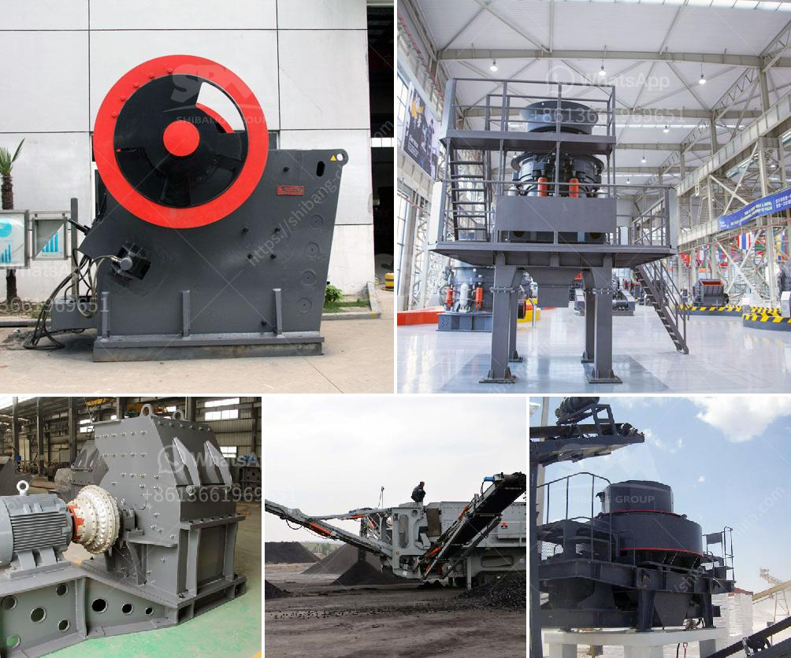

<h3>purchase a small rock stone crusher in philippines</h3>
Purchasing a small rock stone crusher in the Philippines is a profitable idea for those looking to invest in a new business venture. With the increasing demand for stones in the construction industry, there is no better time than now to start your own small-scale rock crushing operation.

Investing in a rock crusher allows you to process different types of stones, such as granite, basalt, limestone, marble, and even pebbles, into various sizes of construction aggregates. These aggregates can be used in the production of concrete, asphalt, and other building materials, making them highly sought after in the market.

Before purchasing a rock crusher, it is essential to consider several factors to ensure a successful and profitable operation. First and foremost, you need to determine the type and size of the rock crusher that suits your specific requirements. There are various types available in the market, including jaw crushers, cone crushers, impact crushers, and even portable crushers, which can be transported to different locations.

Next, you need to consider the capacity of the rock crusher. This refers to how much stone material the crusher can handle per hour. It is crucial to choose a rock crusher with the appropriate capacity that can meet the demands of your target market. Additionally, it is essential to consider the input size of the stones and the output size of the final product. The crusher should be capable of crushing the stones into the desired sizes as per the requirements of your customers.

Apart from the technical aspects, you should also consider the overall cost of owning and operating a rock crusher in the Philippines. This includes the initial purchase price, transportation costs, maintenance expenses, and any potential licensing or legal requirements. Additionally, it is vital to analyze the potential return on investment to ensure the profitability of your venture. Conducting thorough market research and assessing the current demand for construction aggregates in your area can help you determine the potential profitability of your rock crushing business.

When purchasing a rock crusher, it is highly recommended to buy from a reputable supplier. Look for a supplier that offers durable and reliable crushers, provides excellent customer service, and has a track record of delivering high-quality equipment. You can also consider reading customer reviews and testimonials to gauge their satisfaction with the products and services offered by the supplier.

Once you have purchased your rock crusher, you need to market your business and find potential customers. This may involve reaching out to local construction companies, contractors, and government agencies responsible for infrastructure projects. Additionally, creating an online presence through a website and utilizing social media platforms can help you reach a wider audience and generate leads for your business.

In conclusion, purchasing a small rock stone crusher in the Philippines can be a profitable investment. However, it is crucial to consider all the necessary factors, including the type and size of the crusher, its capacity, and overall costs. With proper research, planning, and marketing strategies, starting a rock crushing business can lead to a successful and fulfilling career in the construction industry.
<h3>Contact us</h3><ul><li><strong>Whatsapp:&nbsp;<a href="https://wa.me/8613661969651">+8613661969651</a></strong></li><li><a href="https://swt.shibang-china.com/?git&amp;zhl&amp;purchase a small rock stone crusher in philippines"><strong>Online Service(chat now)</strong></a></li></ul><h3>Related</h3><ul><li><a href='quarry crusher equipments and machinery.md'>quarry crusher equipments and machinery</a></li><li><a href='granite gypsum quarry.md'>granite gypsum quarry</a></li><li><a href='stone crushers in ethiopia.md'>stone crushers in ethiopia</a></li><li><a href='safety videos of belt conveyors in hindi.md'>safety videos of belt conveyors in hindi</a></li><li><a href='mobile crusher hire durban.md'>mobile crusher hire durban</a></li></ul>