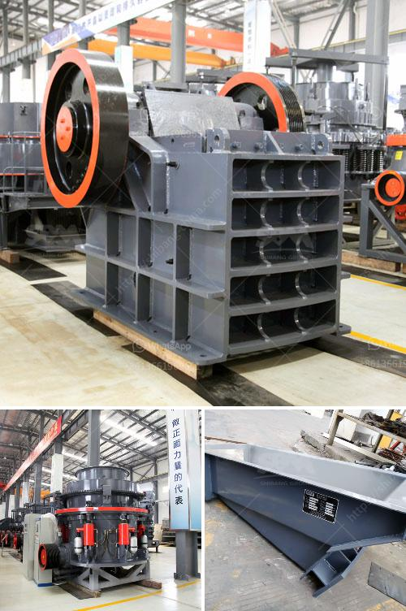

<h3>puzzolana crusher plant nairobi kenya</h3>
Puzzolana Machinery Fabricators (Hyderabad) LLP is a renowned manufacturer and supplier of crushing and screening equipment. Their extensive range of products includes mobile crushing plants, jaw crushers, impact crushers, cone crushers, vibrating screens and more. Puzzolana has recently entered into a partnership with the prestigious Kenyan construction company, B.M.S. Engineering Contractors Ltd. This partnership aims to deliver quality machinery and support to the Kenyan construction industry.

Nairobi, the capital city of Kenya, is experiencing a construction boom with numerous government and private infrastructure projects in progress. To cater to this growing demand, Puzzolana has launched their latest 250 TPH jaw and cone crushers. These two machines are designed specifically to meet the demands of the Kenyan construction industry as they are compact, easy to transport, and are able to produce high-quality aggregates.

What sets Puzzolana apart from their competitors is their commitment to providing after-sales support. They have established a dedicated service team in Nairobi that is available 24/7 to assist their customers with any technical or operational issues. Puzzolana also conducts regular training sessions for operators and maintenance personnel to ensure the proper use and upkeep of their equipment.

By partnering with B.M.S. Engineering Contractors Ltd, Puzzolana aims to establish a strong presence in the Kenyan market. B.M.S. Engineering Contractors Ltd has an excellent track record in the construction industry and is known for their quality workmanship and timely project completion. With their local expertise and Puzzolana's advanced machinery, the partnership is poised to make a significant impact on the construction sector in Nairobi.

In conclusion, Puzzolana's entry into the Kenyan market is a promising development for the construction industry in Nairobi. Their high-quality machinery and commitment to after-sales support make them a reliable choice for contractors looking to enhance their productivity and efficiency. With the backing of B.M.S. Engineering Contractors Ltd, Puzzolana is well-positioned to cater to the growing demand for crushing and screening equipment in Nairobi, Kenya.
<h3>Contact us</h3><ul><li><strong>Whatsapp:&nbsp;<a href="https://wa.me/8613661969651">+8613661969651</a></strong></li><li><a href="https://swt.shibang-china.com/?git&amp;zhl&amp;puzzolana crusher plant nairobi kenya"><strong>Online Service(chat now)</strong></a></li></ul><h3>Related</h3><ul><li><a href='quarry crusher manufacturer.md'>quarry crusher manufacturer</a></li><li><a href='grinding machine for calciun carbinate from germany.md'>grinding machine for calciun carbinate from germany</a></li><li><a href='slag ball mill crusher.md'>slag ball mill crusher</a></li><li><a href='mobile crushing and screening manufacturer in india.md'>mobile crushing and screening manufacturer in india</a></li><li><a href='silica sand grinding machine cost.md'>silica sand grinding machine cost</a></li></ul>