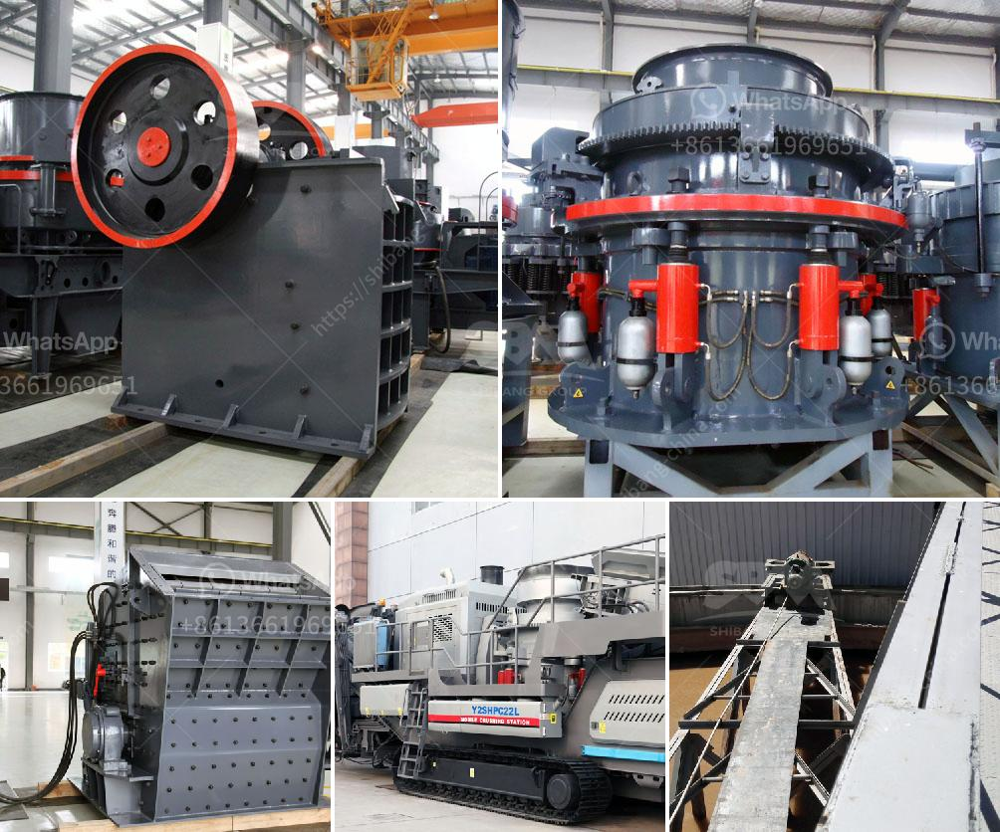

<h3>puzzolana stone crusher</h3>
Puzzolana is a stone crusher machine company from Hyderabad, India, involved in the design, manufacture, installation, and commissioning of advanced machinery such as crushers and sand making machines. Its products are renowned for their robustness and high-quality, backed by unmatched customer service.

The company has been in the industry for over five decades now and has established itself as a leader in its field. Puzzolana stone crushers are used in various sectors such as mining, chemical, infrastructure, and construction. It is one of the largest stone crusher manufacturers in the country and has collaborations with numerous international agencies and organizations.

One of the key features of puzzolana stone crusher machines is their excellent operating capability. The machines are known to provide users with highly efficient and productive outputs. This is achieved through the use of advanced technology and high-quality materials. The crushers are designed to withstand tough and abrasive materials, ensuring longer operational life and reduced downtime.

Furthermore, puzzolana stone crushers are highly energy-efficient and eco-friendly. Their low operating costs and sustainable designs make them a popular choice among environmentally conscious individuals and organizations. They comply with all relevant international standards and regulations, ensuring that their usage has minimal impact on the environment.

In addition to their efficient operation, puzzolana stone crushers are equipped with user-friendly controls and features that make operation and maintenance simple and hassle-free. The machines are easy to assemble, and spare parts are readily available. This ensures that any maintenance and repair needs can be quickly addressed, minimizing downtime and maximizing productivity.

Puzzolana stone crushers are known for their outstanding reliability, and the company takes the utmost care to ensure that each product meets the highest quality standards. The machines are subjected to rigorous quality tests at each stage of the manufacturing process to ensure that they deliver optimal performance without any defects.

The company also places great emphasis on customer service and after-sales support. Puzzolana provides comprehensive training programs for operators and maintenance personnel, ensuring that they are well-equipped to handle the machines effectively. Additionally, the company has a dedicated team of service engineers who are available round the clock to address any customer concerns and provide timely assistance.

Puzzolana stone crushers have gained a reputation for delivering superior performance, making them an ideal choice for many businesses and industries. Whether it is crushing hard rocks or processing materials for construction, the machines provide reliable and efficient solutions. With continuous innovation and a focus on customer satisfaction, Puzzolana continues to lead the way in the stone crusher industry.

In conclusion, Puzzolana stone crushers are known for their outstanding performance and robust construction. With a dedicated team and excellent after-sales support, the company ensures that each customer receives the best possible service. Whether for mining, chemical, infrastructure, or construction applications, Puzzolana stone crushers are a reliable and efficient choice.
<h3>Contact us</h3><ul><li><strong>Whatsapp:&nbsp;<a href="https://wa.me/8613661969651">+8613661969651</a></strong></li><li><a href="https://swt.shibang-china.com/?git&amp;zhl&amp;puzzolana stone crusher"><strong>Online Service(chat now)</strong></a></li></ul><h3>Related</h3><ul><li><a href='aggregate machinery.md'>aggregate machinery</a></li><li><a href='minerio de maquina de lavar maquina de lavar mineral.md'>minerio de maquina de lavar maquina de lavar mineral</a></li><li><a href='manufacturing process of cement.md'>manufacturing process of cement</a></li><li><a href='pulverized ball mills.md'>pulverized ball mills</a></li><li><a href='small scale gold process pictures.md'>small scale gold process pictures</a></li></ul>