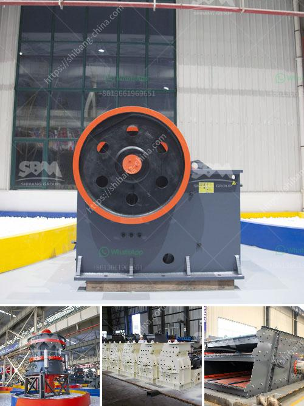

<h3>quarry crusher business in south africa</h3>
Quarry crusher business is a booming industry in South Africa, with numerous opportunities for businesses operating in this space. With the recent surge in demand for quarry crusher products, many new players are entering the market, making it more competitive than ever. This article will outline the various aspects of quarry crusher business in South Africa and explore the potential opportunities and challenges it presents.

The quarry crusher industry in South Africa alone generates over $2 billion annually. A huge number of abandoned quarries exist throughout the country, posing an enormous environmental threat as well as a massive opportunity. These quarries could be rehabilitated and transformed into profitable ventures that provide much-needed raw materials for infrastructural development.

One of the main advantages of investing in a quarry crusher business is the abundance of raw materials in South Africa. Limestone, granite, and sandstone are all readily available for mining, providing an ample supply for the industry. Additionally, the country's diverse geological landscapes make it possible for quarry crusher businesses to extract and process different types of materials, catering to a wide range of customer needs.

South Africa's infrastructural development is another factor driving the demand for quarry crusher products. The government has emphasized the importance of investing in infrastructure to stimulate economic growth, which has led to a surge in construction projects across the country. These projects require a significant amount of construction materials, such as aggregates, sand, and crushed stones, which are all produced by quarry crusher businesses.

Moreover, the quarry crusher industry has a positive impact on job creation and economic development in South Africa. The industry directly employs thousands of workers, providing them with stable income and improving their livelihoods. Additionally, quarry crusher businesses also create opportunities for local suppliers and service providers, boosting the overall economy and creating a multiplier effect on employment.

However, despite the numerous opportunities, quarry crusher business in South Africa also faces several challenges. Environmental concerns and regulations are significant issues that need to be taken into consideration. Quarrying activities often have negative impacts on the environment, such as soil erosion, water pollution, and deforestation. Quarry crusher businesses must comply with strict environmental standards and implement sustainable practices to mitigate these impacts and ensure long-term viability.

Furthermore, the industry is highly competitive, both locally and internationally. South Africa competes with countries such as China and India, which have lower production costs and can offer products at lower prices. Quarry crusher businesses need to continuously improve their efficiency, reduce costs, and enhance the quality of their products to stay competitive in the global market.

In conclusion, the quarry crusher business in South Africa is a booming industry with numerous opportunities and challenges. The abundance of raw materials, infrastructural development, and job creation make it an attractive sector for investment. However, businesses in this industry must navigate environmental concerns, comply with regulations, and stay competitive to thrive in the market. With proper planning and strategic management, quarry crusher businesses can contribute significantly to South Africa's economic growth and development.
<h3>Contact us</h3><ul><li><strong>Whatsapp:&nbsp;<a href="https://wa.me/8613661969651">+8613661969651</a></strong></li><li><a href="https://swt.shibang-china.com/?git&amp;zhl&amp;quarry crusher business in south africa"><strong>Online Service(chat now)</strong></a></li></ul><h3>Related</h3><ul><li><a href='china raymond mill company.md'>china raymond mill company</a></li><li><a href='sp 60x100 jaw crusher.md'>sp 60x100 jaw crusher</a></li><li><a href='iron ore washing plant.md'>iron ore washing plant</a></li><li><a href='crushing plant design and layout considerations.md'>crushing plant design and layout considerations</a></li><li><a href='small scale gold process pictures.md'>small scale gold process pictures</a></li></ul>