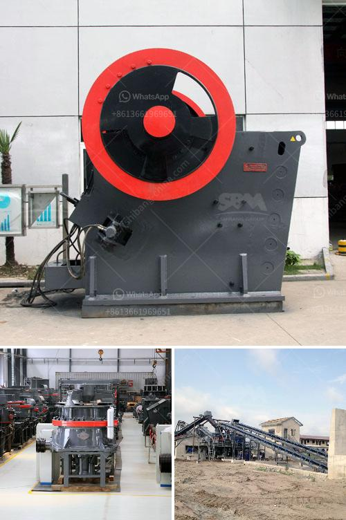

<h3>quarry crusher machine equipment in germany prices</h3>
Quarrying operations can be made easy with the use of advanced equipment available today. Companies that specialize in quarrying stones and rocks have increased their productivity and efficiency thanks to the latest machinery and equipment. One such machine that is helping to revolutionize the quarrying industry is the quarry crusher machine.

Germany, a country known for its rich mining history, is currently growing its quarrying industry. Major operations in the country are found in the states of Bavaria and North Rhine-Westphalia. Thanks to advanced quarrying equipment, Germany has become a prime location for producing high-quality aggregates and stones.

The quarry crusher machine equipment in Germany plays an important role in the construction industry as a whole. It is responsible for breaking down larger rocks, gravel, or rock dust into smaller pieces, making them easier to be transported or used for further construction purposes.

One of the most notable advantages of the quarry crusher machine is its low operating costs. Germany has advanced technology of manufacturing stone cone crusher plant. Zenith absorbs the advanced technology from Germany and combines this with our own production experience to produce the cone crusher as the main secondary crushing machine used in mining line for sale.

The cone crusher machine can be used as the silver ore crushing machine. Compared with the traditional crushing equipment, it has many advantages such as reliable operation, low failure rate, and easy maintenance. Zenith Company is the leading professional supplier of solution, equipment and service for quarry crusher and grinding mill industry. Zenith developed complete series of quarry crusher machine in Germany for sale, such as jaw crusher, impact crusher, cone crusher, gyratory crusher, VSI crusher etc.

The quarry crusher machine is available with several types of crushing and milling machines. With respect to the production and energy consumption, the use of the cone crusher as a medium-fine crusher guarantees the production efficiency of the stone. It is known to all that the cone crusher machine can be widely applied to the production of high-quality stones for construction teams. Apart from this, its versatility is also a key factor that helps to boost its popularity.

In terms of price, the quarry crusher machine in Germany consists of a combination of crushing equipment. The price is determined by the crushing equipment and other auxiliary equipment of the production line. In addition to the value of the equipment itself, the value of the steel, the quarrying process, and the quarry site are also an important factor in determining the price.

Germany is one of the leading countries in the industrial machinery industry, with reliable equipment and advanced technology. With a variety of crushing equipment, the quarry crusher machine in Germany performs well and has a larger production capacity. The combination of advanced technology and excellent manufacturing materials not only enhances its performance but also prolongs its service life, providing a strong guarantee for the efficient operation of the entire production line.

In conclusion, the quarry crusher machine equipment in Germany provides high-quality materials for the construction industry. The advanced technology and lower operating costs of this crusher machine are believed to contribute to its popularity. With a variety of crushing equipment, it has a wider application in the production of stones used for construction purposes. With Germany's reputation for industrial excellence, the quarry crusher machine equipment in Germany is setting the standard for the quarrying industry worldwide.
<h3>Contact us</h3><ul><li><strong>Whatsapp:&nbsp;<a href="https://wa.me/8613661969651">+8613661969651</a></strong></li><li><a href="https://swt.shibang-china.com/?git&amp;zhl&amp;quarry crusher machine equipment in germany prices"><strong>Online Service(chat now)</strong></a></li></ul><h3>Related</h3><ul><li><a href='industrial grinder fine powder.md'>industrial grinder fine powder</a></li><li><a href='vibrating screen suppliers in philippines.md'>vibrating screen suppliers in philippines</a></li><li><a href='aggregate crusher plant price.md'>aggregate crusher plant price</a></li><li><a href='coal sludge rotary dryer supplier india.md'>coal sludge rotary dryer supplier india</a></li><li><a href='price of grinder machine in bangladesh.md'>price of grinder machine in bangladesh</a></li></ul>