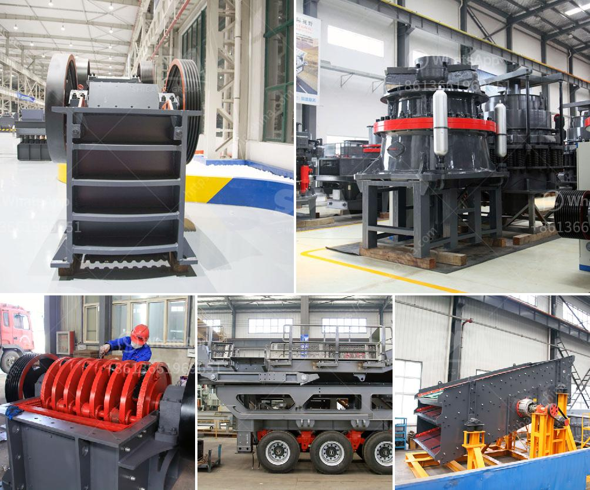

<h3>quarry crusher manufacturer</h3>
Mining operations require a wide array of machines to extract the desired ore or minerals. Among the machines needed, one of the most important is the quarry crusher manufacturer. These machines are designed to break larger rocks into smaller rocks or gravel, allowing for easy transportation and further processing. Quarry crushers play a vital role in the mining industry, as they help in producing the required aggregates and minerals for construction and other purposes.

A quarry crusher manufacturer specializes in designing and manufacturing crushing machines for mining operations. These machines are typically used in quarries, where the raw materials are extracted from the earth’s surface. The quarry crusher manufacturer understands the demanding nature of the mining industry and strives to provide reliable products that can withstand harsh conditions.

One of the key features of a quarry crusher manufacturer is their ability to produce crushers with varying capacities suitable for different mining operations. This flexibility allows miners to choose the right machine for their particular needs. Whether it's a small-scale operation or a large mining site, the quarry crusher manufacturer can provide equipment that meets the required specifications.

In addition to producing crushers, quarry crusher manufacturers also offer complete crushing solutions. They provide machines like vibrating screens, feeders, and conveyors that work in harmony with the crusher to maximize efficiency and productivity. These complementary equipment pieces ensure that the entire crushing process is streamlined and automated, reducing manual labor and improving overall output.

Safety is of paramount importance in the mining industry, and quarry crusher manufacturers prioritize it in their machines. They incorporate various safety features into the design, making them safe to operate even in challenging environments. These features may include emergency stops, protective guards, and advanced control systems that minimize the risk of accidents.

Another crucial aspect that quarry crusher manufacturers focus on is the ease of maintenance. They understand that mining operations can be demanding, and machines must be easy to maintain to minimize downtime. By making their crushers and related equipment user-friendly and accessible for maintenance and repair, these manufacturers ensure that miners can quickly resolve any issues and resume operations promptly.

Moreover, quarry crusher manufacturers also prioritize environmental sustainability. They develop machines that are energy-efficient and minimize the environmental impact of mining activities. This commitment to sustainability aligns with global efforts to minimize carbon footprints and preserve the planet for future generations.

In conclusion, quarry crusher manufacturers serve a vital role in the mining industry. Their expertise in designing and manufacturing crushers and related equipment is crucial for efficient and sustainable mining operations. By providing machines that are reliable, customizable, and easy to maintain, quarry crusher manufacturers help miners extract the desired raw materials while ensuring safety and environmental consciousness. As the mining industry continues to grow, the demand for high-quality crushers from reputable manufacturers will remain strong.
<h3>Contact us</h3><ul><li><strong>Whatsapp:&nbsp;<a href="https://wa.me/8613661969651">+8613661969651</a></strong></li><li><a href="https://swt.shibang-china.com/?git&amp;zhl&amp;quarry crusher manufacturer"><strong>Online Service(chat now)</strong></a></li></ul><h3>Related</h3><ul><li><a href='linear vibrating screen specifications.md'>linear vibrating screen specifications</a></li><li><a href='quartz powder making machine in andhra pradesh.md'>quartz powder making machine in andhra pradesh</a></li><li><a href='coal powder making.md'>coal powder making</a></li><li><a href='equipment for crushing gravel.md'>equipment for crushing gravel</a></li><li><a href='to see vibrating screens.md'>to see vibrating screens</a></li></ul>