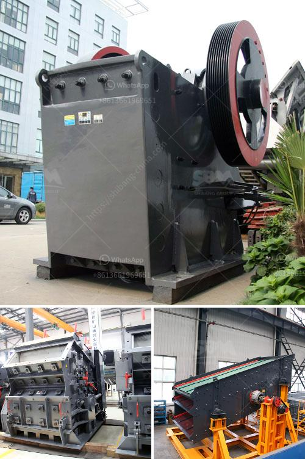

<h3>quarry crusher manufacturere</h3>
The mining industry has been a major contributor to economic growth and development globally. It provides raw materials for various sectors such as construction, manufacturing, and energy. One of the vital components in mining operations is the quarry crusher, a machine that processes raw materials and converts them into smaller-sized particles.

A quarry crusher manufacturer plays a crucial role in the mining industry. They provide the essential equipment and machinery required for crushing rocks, stones, and other minerals. These machines are used extensively in quarries, as they help extract raw materials efficiently and effectively. Let's explore the significance of quarry crusher manufacturers in the mining industry.

1. Quality Equipment: Quarry crusher manufacturers design and develop reliable and high-quality equipment for mining operations. They ensure that the machines can withstand the harsh conditions in quarries, including extreme temperatures, dust, and vibrations. These manufacturers invest in research and development to design crushers that increase productivity while reducing downtime and maintenance costs.

2. Customization: Quarry crusher manufacturers understand that various mining operations have diverse requirements. They offer customized solutions to cater to specific needs. Whether it is a primary, secondary, or tertiary crusher, these manufacturers provide machines with different specifications to optimize productivity and efficiency.

3. Safety: Safety is paramount in the mining industry. A reputable quarry crusher manufacturer prioritizes safety in their equipment design and production. They incorporate safety features such as easy access to key components for maintenance, advanced monitoring systems, and ergonomic designs to minimize accidents and injuries in the workplace.

4. Environmental Considerations: Today, sustainability and environmental conservation are critical concerns for the mining industry. Quarry crusher manufacturers are increasingly focusing on developing eco-friendly equipment. They incorporate advanced technologies that reduce energy consumption, emissions, and noise levels. This helps mining companies adhere to regulatory standards and minimize their impact on the environment.

5. After-sales Support: Quarry crusher manufacturers provide comprehensive after-sales support to their customers. They offer services such as installation, training, maintenance, and spare parts supply. This ensures that the machines operate at optimum levels and have a longer service life. Manufacturers often have a dedicated team of technicians who provide prompt assistance to resolve any issues, minimizing downtime for mining companies.

In conclusion, a quarry crusher manufacturer is an essential partner in the mining industry. Their equipment and machinery play a crucial role in extracting raw materials efficiently and safely. These manufacturers provide quality machines that are customized for specific mining operations. Moreover, they prioritize safety and environmental considerations, making their equipment suitable for sustainable mining practices. With comprehensive after-sales support, these manufacturers ensure that their customers' machines operate at peak performance. As mining continues to be a fundamental activity for global development, the role of quarry crusher manufacturers remains indispensable.
<h3>Contact us</h3><ul><li><strong>Whatsapp:&nbsp;<a href="https://wa.me/8613661969651">+8613661969651</a></strong></li><li><a href="https://swt.shibang-china.com/?git&amp;zhl&amp;quarry crusher manufacturere"><strong>Online Service(chat now)</strong></a></li></ul><h3>Related</h3><ul><li><a href='tertiary impact crushers for quartz.md'>tertiary impact crushers for quartz</a></li><li><a href='jaw crushing plant.md'>jaw crushing plant</a></li><li><a href='ball mills sizes.md'>ball mills sizes</a></li><li><a href='how to make a stone crushing plant.md'>how to make a stone crushing plant</a></li><li><a href='magnesite processing plant.md'>magnesite processing plant</a></li></ul>