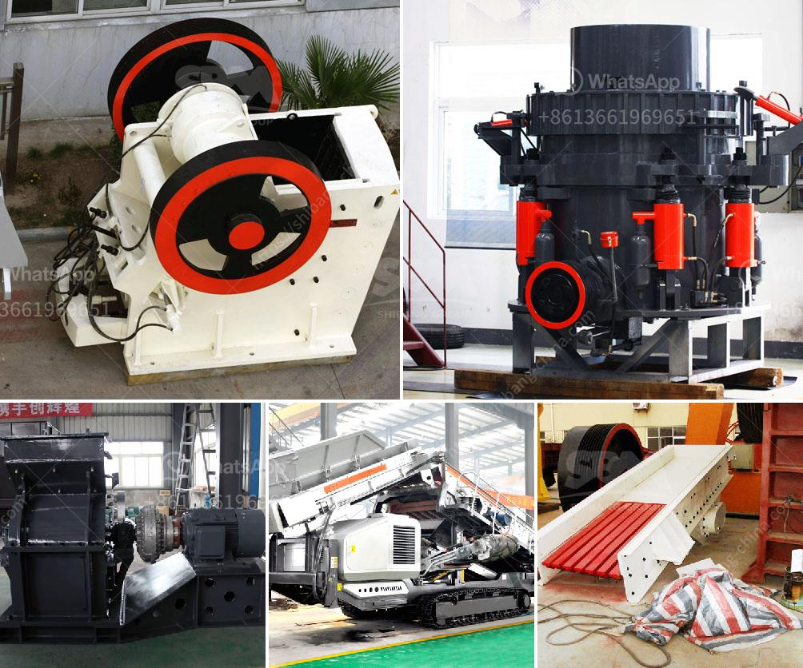

<h3>quarry crusher mine stone</h3>
The quarrying industry is one of the major contributors to the world's economy. Mining natural resources has been a crucial part of human evolution and progress. Stone, in particular, has been used for various purposes, ranging from construction to creating beautiful works of art. As the demand for stone continues to rise, the need for efficient and safe methods of extracting it becomes paramount. This is where quarry crushers come into play.

A quarry crusher is a machine that extracts stone fragments from a quarry. It is also commonly referred to as a rock crusher or stone crusher. The quarry crusher is applied to industries like mining, construction, and demolition, paving the way for a more sustainable and efficient future.

One of the primary benefits of quarry crushers is safety. Traditional methods of mining stone, such as explosives, can be dangerous and unpredictable. Blasting can cause vibrations, which may lead to structural damage or even the collapse of nearby structures. Additionally, the release of toxic gases during the blasting process poses a threat to workers' health. Quarry crushers, on the other hand, offer a significantly safer alternative.

Quarry crushers work by breaking down large rocks into smaller, more manageable pieces. The process is carried out using mechanical force, ensuring the controlled extraction of stone. This eliminates the risks associated with explosives and their potential to cause accidents. Operators can safely operate the quarry crusher from a distance, reducing the likelihood of injuries. This makes the quarrying process much safer for workers and surrounding communities.

Furthermore, quarry crushers enhance productivity and efficiency in the mining industry. With traditional stone mining methods, large quantities of stone may need to be blasted to obtain smaller fragments. This process is both time-consuming and resource-intensive. Quarry crushers, however, can extract stone fragments more efficiently, reducing the amount of waste produced from unnecessary blasting. Thus, the use of quarry crushers leads to a more sustainable mining process, promoting the conservation of natural resources.

In addition to safety and efficiency, quarry crushers also offer economic benefits. By optimizing the extraction process, quarry crushers increase the output of stone, leading to higher profits for mining companies. The enhanced productivity allows miners to meet the increasing demand for stone in various industries, including construction and infrastructure development. Furthermore, the reduced cost of managing explosives and their associated risks translates into lower operational expenses.

Another advantage of quarry crushers is the opportunity for recycling and reusing materials. Stone extracted from a quarry crusher can be repurposed for various construction projects, including roadworks and building foundations. This not only reduces the need for new stone extraction but also contributes to environmental sustainability by minimizing waste. The ability to recycle and reuse stone fragments makes quarry crushers an integral part of the circular economy.

In conclusion, quarry crushers provide a safe, efficient, and sustainable method for mining stone. With an increasing global demand for stone, the industry must adapt to more environmentally friendly practices. Quarry crushers eliminate the risks associated with traditional mining methods while promoting productivity and economic growth. By embracing these innovative machines, the mining industry can pave the way towards a more sustainable future.
<h3>Contact us</h3><ul><li><strong>Whatsapp:&nbsp;<a href="https://wa.me/8613661969651">+8613661969651</a></strong></li><li><a href="https://swt.shibang-china.com/?git&amp;zhl&amp;quarry crusher mine stone"><strong>Online Service(chat now)</strong></a></li></ul><h3>Related</h3><ul><li><a href='how to build a concrete crusher.md'>how to build a concrete crusher</a></li><li><a href='chrome washing plant for sale.md'>chrome washing plant for sale</a></li><li><a href='grinding machine for bentonite.md'>grinding machine for bentonite</a></li><li><a href='concrete plants for sale in spain.md'>concrete plants for sale in spain</a></li><li><a href='cement stone crusher for sale.md'>cement stone crusher for sale</a></li></ul>