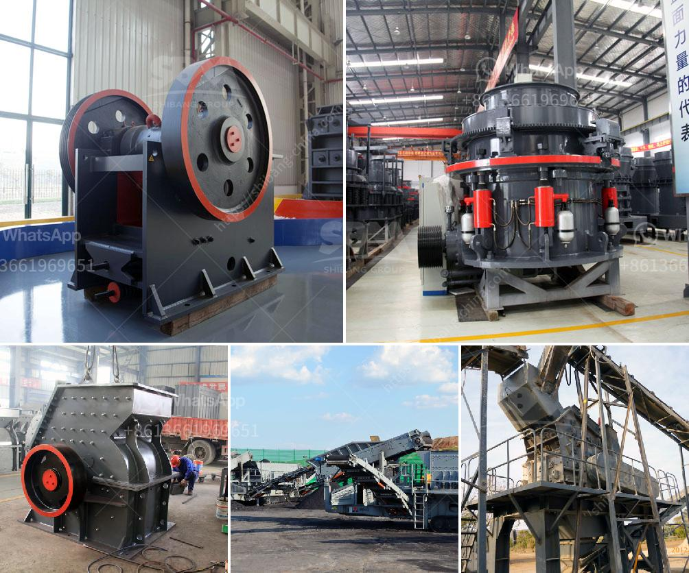

<h3>quarry crusher price</h3>
When it comes to choosing equipment for your mining or quarrying operation, one of the most critical factors to consider is the price of the machinery. The quarry crusher price is influenced by a variety of factors, including the quality, production capacity, and the manufacturer's reputation. However, in the current market scenario, it is important to strike the right balance between affordability and functionality.

The first aspect to consider is the quality of the quarry crusher. Investing in a high-quality machine may cost more initially, but it can offer significant benefits in the long run. A durable and reliable crusher will require minimal maintenance and repairs, saving you time and money on upkeep. Additionally, it will increase your productivity and efficiency, allowing you to extract more materials in a shorter timeframe.

Apart from quality, the production capacity of the crusher also plays a crucial role in determining its price. If your quarry operation demands high volumes of materials on a daily basis, investing in a crusher with a higher production capacity will be more cost-effective in the long term. This will prevent bottlenecks and ensure a steady supply of materials for further processing.

Choosing the right manufacturer is equally important. Reputed manufacturers often offer better warranties, after-sales support, and spare parts availability. This can greatly reduce the overall cost of owning and operating the crusher. It is advisable to research and compare different manufacturers to find the one that best suits your requirements while offering competitive prices.

Lastly, it is crucial to consider your budget and financial capabilities before finalizing a purchase. Set a realistic budget and explore various financing options available. Some manufacturers may offer flexible payment plans to help make the investment more manageable.

In conclusion, the quarry crusher price should be viewed as an investment rather than a mere expense. By prioritizing quality, production capacity, and reputable manufacturers, you can find a crusher that offers the right value for your investment. Remember to consider your budget and explore financing options to make the purchase more feasible. A well-chosen crusher will not only boost your productivity but also ensure a smooth operation, contributing to the success of your mining or quarrying business.
<h3>Contact us</h3><ul><li><strong>Whatsapp:&nbsp;<a href="https://wa.me/8613661969651">+8613661969651</a></strong></li><li><a href="https://swt.shibang-china.com/?git&amp;zhl&amp;quarry crusher price"><strong>Online Service(chat now)</strong></a></li></ul><h3>Related</h3><ul><li><a href='equipment for quarry.md'>equipment for quarry</a></li><li><a href='lime powder making machine.md'>lime powder making machine</a></li><li><a href='crushers price in south africa product.md'>crushers price in south africa product</a></li><li><a href='china raymond mill company.md'>china raymond mill company</a></li><li><a href='impact crushers manufacture.md'>impact crushers manufacture</a></li></ul>