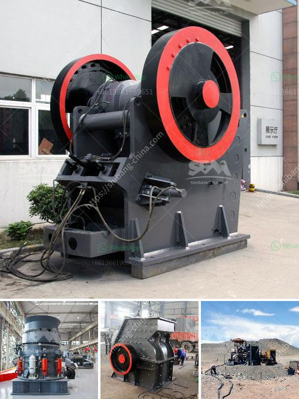

<h3>quarry equipment cost</h3>
The cost of quarry equipment can vary greatly depending on the type of equipment needed and its specifications. Typically, quarry equipment can range from a few thousand dollars to several million dollars.

The cost of equipment ultimately depends on several factors. One of the key factors is the size and complexity of the quarry operation. A small quarry may only require basic machinery such as excavators and dump trucks, while a larger quarry may require more specialized equipment such as crushers and screeners. Additionally, the intended production capacity of the quarry will also impact the cost. Higher capacity quarries will require larger and more powerful equipment, which in turn will increase the overall cost.

The type and quality of the equipment needed will also affect the cost. Some quarry equipment, such as crushers and screeners, can be mounted on wheeled or tracked bases, which increases their mobility and versatility. However, this also adds to the cost. Similarly, the utilization of more advanced technology, such as automated controls or remote monitoring, can make the equipment more efficient but can also increase the cost.

Another cost consideration is the maintenance and operating cost of the equipment. Some equipment, such as crushers and screeners, will require regular maintenance and servicing to ensure their optimal performance. The cost of spare parts and maintenance services should be factored into the overall cost of equipment ownership.

In addition to the purchase cost and maintenance costs, there may also be other operating costs associated with quarry equipment. These can include fuel, electricity, and labor costs. Fuel costs will depend on the type and size of the equipment, as well as the distance the equipment needs to travel within the quarry. Electricity costs will vary depending on the equipment's power requirements, while labor costs will depend on the number of personnel required to operate the equipment.

When considering the cost of quarry equipment, it is essential to evaluate the potential return on investment (ROI). A well-optimized quarry operation can generate significant revenue, making the investment in high-quality equipment worthwhile. On the other hand, choosing cheaper, lower-quality equipment may result in frequent breakdowns and maintenance issues, leading to higher operating costs and lost production time.

To optimize the cost and performance of quarry equipment, it is crucial to assess the specific needs and requirements of the quarry operation. Consulting with industry experts and equipment manufacturers can help identify the most suitable equipment options and provide valuable insights into the long-term cost implications.

In conclusion, the cost of quarry equipment can vary significantly depending on factors such as operations' size, equipment type, and specifications. It is important to consider not only the purchase cost but also ongoing maintenance, operating costs, and potential ROI. Investing in high-quality equipment that meets the specific needs of the quarry can result in increased productivity, reduced downtime, and improved profitability.
<h3>Contact us</h3><ul><li><strong>Whatsapp:&nbsp;<a href="https://wa.me/8613661969651">+8613661969651</a></strong></li><li><a href="https://swt.shibang-china.com/?git&amp;zhl&amp;quarry equipment cost"><strong>Online Service(chat now)</strong></a></li></ul><h3>Related</h3><ul><li><a href='impact crusher suppliers italy.md'>impact crusher suppliers italy</a></li><li><a href='desain gambar vibrating screen 100ton jam.md'>desain gambar vibrating screen 100ton jam</a></li><li><a href='conveyor belts for dies.md'>conveyor belts for dies</a></li><li><a href='impact coal crusher.md'>impact coal crusher</a></li><li><a href='equipment equipment for mineral crushing.md'>equipment equipment for mineral crushing</a></li></ul>