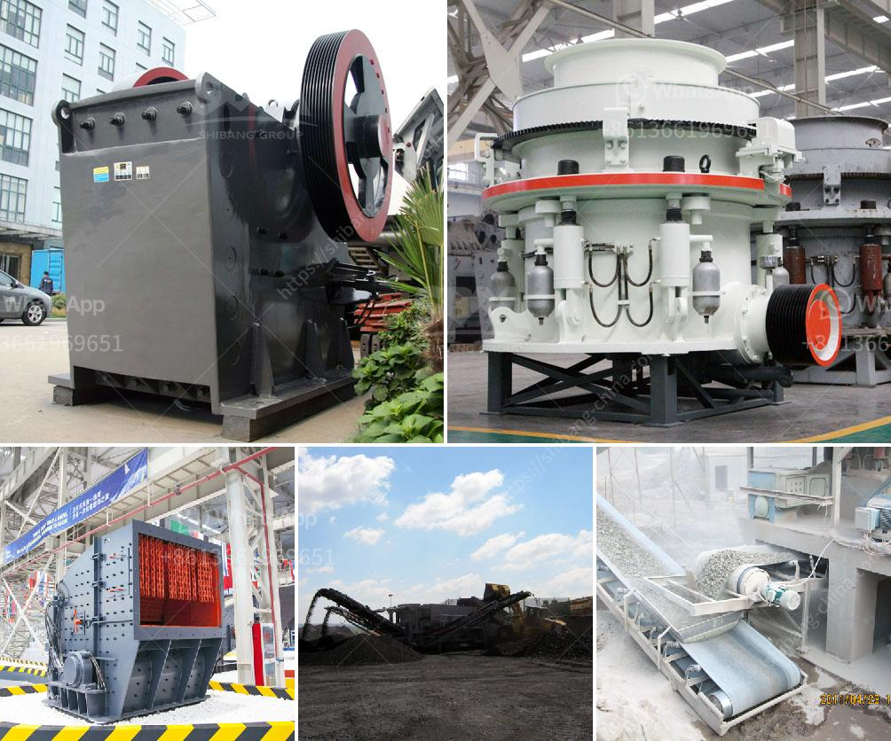

<h3>quarry equipment for sale in indonesia</h3>
Quarry equipment for sale in Indonesia is abundant and diverse. Quarry equipment sets the standard for reliable, energy-efficient and environmentally-friendly mines operations. The large product range consists of different machines and equipment for rock drilling, rock excavation, processing, demolition, and bulk-materials handling.

Quarry equipment for sale in Indonesia includes stone crusher, grinder mill, vibrating screen, and feeder, belt conveyor, washing machine and grinding mill. These quarry crushers are various products coarse crushing, medium crushing, fine crushing for sand-making, and grinding mill, which include ball mill, Raymond mill, super thin grinding mill and so on.

To obtain high quality and large capacity mineral ore materials, quarry equipment is necessary in various places. Depending on the quarry site, jaw crusher, cone crusher, impact crusher, and hammer crusher, hammer mill machines are available to achieve proper size reduction. Quarry equipmentare not rare and also used in various industries such as artificial sand making, cement plants, building, metallurgical, water power etc. quarrying for sale in Indonesia offers a versatile, full line-up of products for customers to maximize their quarry operation.

Quarry equipment for sale in Indonesia is widely used in granite quarry, limestone quarry crusher equipment in Indonesia. One of the largest producers of sand and gravel, quarry mining machinery Indonesia mainly including quarry crusher, quarry and mining machinery for sale in Indonesia, mainly includes vibrating screen, crushing equipment, grinding equipment and screening. Quarry crushing plant is used to crush stones and rocks as large size as possible to the desired size. Quarry crushers play a significant role in the process of quarrying.

In conclusion, quarry equipment for sale in Indonesia is booming. At present, many quarries in Indonesia have made outstanding achievements in infrastructure construction. Quarry equipment sales are growing rapidly, and many enterprises have made tremendous profits. Therefore, the quarry industry in Indonesia is an important mining sector that focuses on the development and expansion of infrastructure and construction projects. As a leading entity in the market, quarry equipment for sale in Indonesia is solving mining industry challenges and achieving the highest capacity and profitability.
<h3>Contact us</h3><ul><li><strong>Whatsapp:&nbsp;<a href="https://wa.me/8613661969651">+8613661969651</a></strong></li><li><a href="https://swt.shibang-china.com/?git&amp;zhl&amp;quarry equipment for sale in indonesia"><strong>Online Service(chat now)</strong></a></li></ul><h3>Related</h3><ul><li><a href='cement stone crusher for sale.md'>cement stone crusher for sale</a></li><li><a href='china grove roller mill.md'>china grove roller mill</a></li><li><a href='contact list of stone crusher companies in south africa.md'>contact list of stone crusher companies in south africa</a></li><li><a href='raymond mill india.md'>raymond mill india</a></li><li><a href='crusher hydroponic cone crusher.md'>crusher hydroponic cone crusher</a></li></ul>