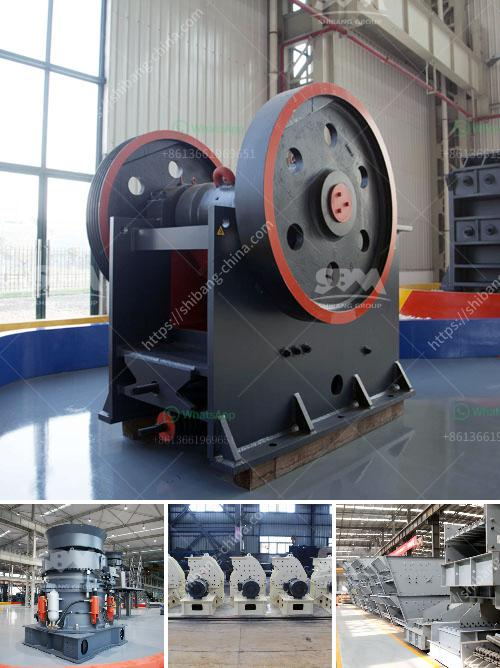

<h3>quarry equipment for sale</h3>
Quarrying involves the extraction of valuable minerals and other geological materials from the earth. It is a crucial activity that forms the foundation of our modern society. Without quarrying, the construction industry, road networks, and infrastructure development would grind to a halt. To support and fuel this essential industry, quarry equipment is necessary.

Quarry equipment refers to a variety of machines used in the extraction and processing of minerals from a quarry. These machines include crushers, screeners, scalpers, drills, conveyors, and loaders, among others. They are responsible for excavating, crushing, screening, and transporting materials required by construction companies, mining operations, and other industries.

When considering quarry equipment for sale, it is essential to find reliable and trustworthy suppliers who offer quality solutions. Here are some factors to consider before making your purchase:

1. Quality of Equipment: Quarry operations involve heavy and rigorous use of machinery. Therefore, the reliability, durability, and quality of the equipment are of paramount importance. Ensure that the equipment you are purchasing is well-built and robust, capable of handling the demanding conditions of a quarry.

2. Efficiency and Productivity: Quarry equipment should be efficient in its operation to maximize productivity. Look for machines that provide high performance, reduce downtime, and require minimal maintenance. Efficient quarry equipment translates into cost savings and increased profitability.

3. Safety Features: Quarrying is often hazardous, and safety should be a priority. Choose equipment that adheres to the latest safety standards and incorporates safety features to protect workers. This includes features such as operator protection guards, emergency stops, tamper-proof controls, and advanced monitoring systems.

4. Adaptability: The quarrying industry is constantly evolving, so the equipment you choose should be adaptable to changing requirements. Opt for machines that are versatile and can perform various tasks, making your operation more flexible and efficient.

5. After-Sales Service and Support: A reliable supplier will offer excellent after-sales service and support. This includes comprehensive warranty coverage, regular maintenance, and prompt assistance in case of breakdowns. Ensure that the supplier has a proven track record of providing reliable support.

6. Cost-Effectiveness: While quality should never be compromised, it is essential to find equipment that offers value for money. Compare prices from different suppliers and evaluate the features, performance, and longevity of the equipment before making a decision. Consider the total cost of ownership, including maintenance and operational expenses, to determine the most cost-effective option.

Quarry equipment is a significant investment, and it is crucial to make an informed decision when purchasing. Take the time to research and consult with experts to ensure that the equipment meets your specific needs.

In conclusion, quarry equipment for sale plays a vital role in the extractive industry. To ensure the success and profitability of your quarrying operation, consider the quality, efficiency, safety features, adaptability, after-sales service, and cost-effectiveness before making a purchase. With the right equipment in place, your quarry can operate smoothly, delivering the materials needed for the construction and infrastructure sectors while maximizing productivity and profitability.
<h3>Contact us</h3><ul><li><strong>Whatsapp:&nbsp;<a href="https://wa.me/8613661969651">+8613661969651</a></strong></li><li><a href="https://swt.shibang-china.com/?git&amp;zhl&amp;quarry equipment for sale"><strong>Online Service(chat now)</strong></a></li></ul><h3>Related</h3><ul><li><a href='operation hammer mill.md'>operation hammer mill</a></li><li><a href='ton hour coal crusher and screen.md'>ton hour coal crusher and screen</a></li><li><a href='coal powder making.md'>coal powder making</a></li><li><a href='gold rock crusher plant portable.md'>gold rock crusher plant portable</a></li><li><a href='quarry crusher mine stone.md'>quarry crusher mine stone</a></li></ul>