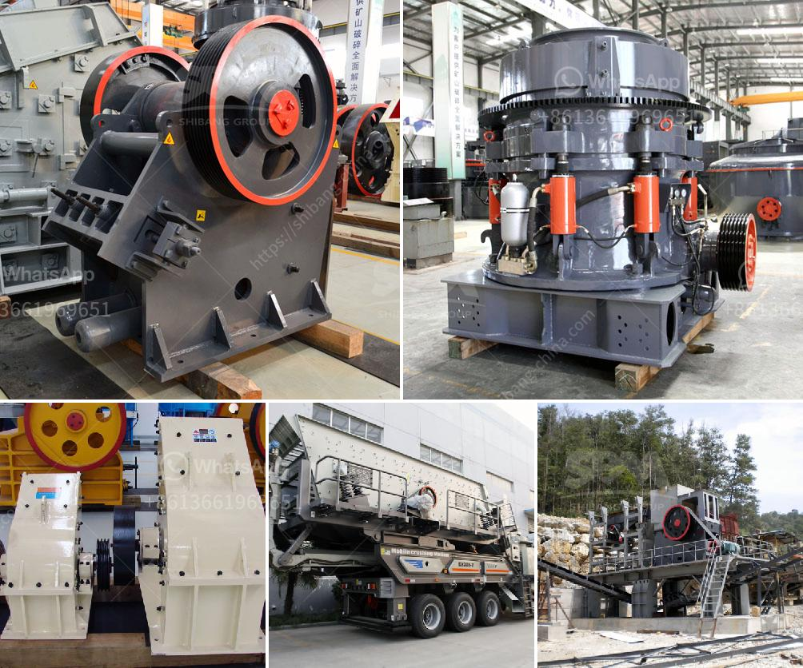

<h3>quarry machinery manufacturers</h3>
Quarrying is the process of extracting natural resources, such as minerals, rocks, and stones, from the earth. It has been a crucial activity throughout history, providing materials for various industries, including construction, road building, and agriculture. To efficiently extract these resources, quarry machinery is essential, and the manufacturers behind these robust machines play a significant role in the sector.

Quarry machinery manufacturers are companies that design, produce, and distribute the equipment used in quarrying operations. They offer a wide range of machinery, including crushers, breakers, screeners, conveyors, and loaders, each serving a specific purpose in the quarrying process. These manufacturers understand the unique requirements of their customers and strive to deliver reliable and high-performing machinery.

One key aspect of quarry machinery manufacturing is innovation. As the industry evolves, manufacturers continuously develop new technologies and machinery to improve efficiency, productivity, and safety. For example, advanced crushers and screeners with features like remote monitoring and automated controls allow operators to perform tasks more effectively. Such innovations not only enhance the operational capabilities of quarries but also contribute to environmental sustainability by reducing emissions and energy consumption.

Additionally, quarry machinery manufacturers prioritize durability and resilience in their designs. Quarrying operations involve heavy usage and often challenging conditions, such as extreme temperatures, moisture, and abrasive materials. Therefore, machinery must be built to withstand these harsh environments while maintaining optimal performance. Experienced manufacturers meticulously select high-quality materials and employ rigorous testing to ensure their machinery can withstand demanding quarrying operations.

Compliance with safety regulations is another crucial aspect emphasized by quarry machinery manufacturers. Quarrying can be a hazardous activity, so manufacturers take extensive measures to ensure their machinery meets safety standards and minimizes risks. From incorporating safety features like emergency stop buttons and guards to providing comprehensive training materials, manufacturers prioritize the safety of quarry workers. They also maintain continuous communication channels with their customers, offering support and guidance regarding safety protocols and maintenance best practices.

Moreover, quarry machinery manufacturers understand the importance of efficient after-sales services. They provide comprehensive warranties, spare parts, and maintenance packages to ensure their customers' machinery continues to operate optimally throughout its lifespan. Timely support and expertise from the manufacturer's technicians help minimize downtime and maximize productivity at quarry sites, ensuring smooth operations.

In conclusion, quarry machinery manufacturers play a pivotal role in the quarrying industry. Through their commitment to innovation, durability, safety, and customer support, they provide the essential machinery required for efficient extraction of natural resources. Their continuous efforts to enhance machinery performance and sustainability contribute to the long-term success of quarrying operations worldwide. As the industry continues to evolve, these manufacturers will undoubtedly remain at the forefront, driving advancements and supporting the needs of the quarrying sector.
<h3>Contact us</h3><ul><li><strong>Whatsapp:&nbsp;<a href="https://wa.me/8613661969651">+8613661969651</a></strong></li><li><a href="https://swt.shibang-china.com/?git&amp;zhl&amp;quarry machinery manufacturers"><strong>Online Service(chat now)</strong></a></li></ul><h3>Related</h3><ul><li><a href='i am looking for a stone crusher in malaysia.md'>i am looking for a stone crusher in malaysia</a></li><li><a href='how to start gold mining in ghana.md'>how to start gold mining in ghana</a></li><li><a href='price stone crusher in nigeria.md'>price stone crusher in nigeria</a></li><li><a href='used quarry equipment from usa.md'>used quarry equipment from usa</a></li><li><a href='crusher machine suppliers.md'>crusher machine suppliers</a></li></ul>