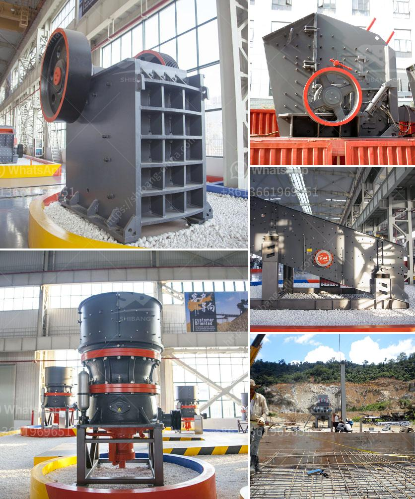

<h3>quarry machines from germany</h3>
Germany is well-known for its high-quality machinery and innovative engineering. Quarry machines from Germany are still highly coveted around the world due to their long-lasting durability and efficient operation. These machines play a critical role in mining and extracting various resources from the earth, making them essential in the construction and infrastructure development sectors.

One of the key reasons why quarry machines from Germany are highly sought after is their exceptional manufacturing process. German manufacturers meticulously design and construct these machines using advanced technologies and superior materials. The result is a product that is built to withstand harsh conditions and operate optimally even in challenging environments.

Another advantage of German quarry machines is their efficiency. These machines are equipped with cutting-edge features and technologies that allow for faster and more precise mining operations. For instance, many German quarry machines are equipped with state-of-the-art drilling and blasting mechanisms that enable them to extract resources seamlessly and with minimal disruption to the surrounding landscape.

Furthermore, German quarry machines are known for their versatility and adaptability. Manufacturers continuously strive to develop machines that can handle a wide range of tasks, from drilling and crushing to grading and sorting. This versatility makes German quarry machines suitable for various mining operations, whether it involves extracting limestone, granite, or even valuable minerals like gold and silver.

The reliability of German quarry machines is also a significant selling point. Due to their meticulous manufacturing process, these machines have a longer lifespan compared to their counterparts from other countries. This means that investing in quarry machines from Germany offers a greater return on investment for quarry owners and operators.

In conclusion, quarry machines from Germany continue to be in high demand due to their outstanding quality, efficiency, versatility, and reliability. These machines are built to withstand demanding environments and have the technology to ensure precise and efficient mining operations. For quarry owners and operators looking to maximize productivity and profitability, investing in quarry machines from Germany is a smart choice.
<h3>Contact us</h3><ul><li><strong>Whatsapp:&nbsp;<a href="https://wa.me/8613661969651">+8613661969651</a></strong></li><li><a href="https://swt.shibang-china.com/?git&amp;zhl&amp;quarry machines from germany"><strong>Online Service(chat now)</strong></a></li></ul><h3>Related</h3><ul><li><a href='gold mining production line or gold mining plant.md'>gold mining production line or gold mining plant</a></li><li><a href='advantages and disadvantages of a roll crusher.md'>advantages and disadvantages of a roll crusher</a></li><li><a href='buy fully gold mining wash plant.md'>buy fully gold mining wash plant</a></li><li><a href='ball mill mexico.md'>ball mill mexico</a></li><li><a href='manufacturers crushing stone.md'>manufacturers crushing stone</a></li></ul>