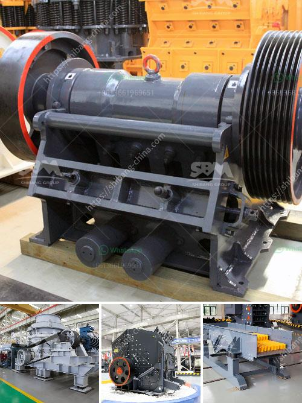

<h3>quarry plant for sale south africa</h3>
South Africa is known for its rich mineral resources and lucrative mining industry. The country is a major producer and exporter of gold, diamonds, platinum, chromium, manganese, and other minerals. One of the key components in the mining industry is the quarry plant, which plays a vital role in extracting and processing various minerals.

A quarry plant is a facility where raw materials such as stone, rock, limestone, and sand are extracted, processed, and manufactured into final products. These products are essential in the construction, infrastructure development, and manufacturing sectors. As South Africa continues to experience rapid urbanization and industrial growth, the demand for quarry plant products is steadily increasing.

Investing in a quarry plant for sale in South Africa can be a lucrative opportunity for entrepreneurs and investors. The country has vast mineral reserves, which ensure a steady supply of raw materials for the quarrying industry. Additionally, South Africa's strategic geographic location ensures easy access to export markets, making it an ideal base for international trade.

The quarrying industry in South Africa is highly competitive, with numerous players vying for market share. However, by investing in a well-equipped and strategically located quarry plant, investors can differentiate themselves from competitors and capture a significant portion of the market.

In recent years, there has been a growing emphasis on sustainable mining practices, including responsible quarrying operations. As a result, many quarry plants in South Africa have implemented environmentally friendly measures to reduce their carbon footprint and mitigate the impact on surrounding communities and ecosystems. This commitment to sustainability not only enhances the reputation of the quarry plant but also attracts potential customers who value ethical and sustainable sourcing.

Furthermore, the South African government has implemented favorable policies and incentives to attract foreign direct investment in the mining sector. These include tax incentives, streamlined licensing processes, and access to funding and grants. Investors looking to acquire a quarry plant in South Africa can take advantage of these incentives to maximize their return on investment.

In conclusion, investing in a quarry plant for sale in South Africa presents a lucrative opportunity for entrepreneurs and investors. With the country's abundant mineral resources, strategic location, and favorable government policies, the quarrying industry is poised for growth. Moreover, by incorporating sustainable practices, quarry plant operators can gain a competitive edge while meeting the increasing demand for their products.
<h3>Contact us</h3><ul><li><strong>Whatsapp:&nbsp;<a href="https://wa.me/8613661969651">+8613661969651</a></strong></li><li><a href="https://swt.shibang-china.com/?git&amp;zhl&amp;quarry plant for sale south africa"><strong>Online Service(chat now)</strong></a></li></ul><h3>Related</h3><ul><li><a href='chinese aggregate crusher suppliers.md'>chinese aggregate crusher suppliers</a></li><li><a href='stone jaw crushers in japan.md'>stone jaw crushers in japan</a></li><li><a href='coal pulverizer manufacturers.md'>coal pulverizer manufacturers</a></li><li><a href='jaw crusher type sp 100 x.md'>jaw crusher type sp 100 x</a></li><li><a href='cost of cement factory setup.md'>cost of cement factory setup</a></li></ul>