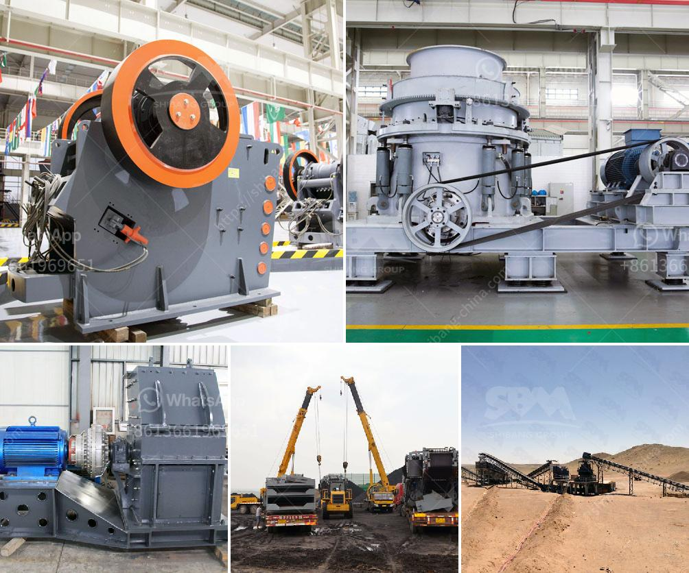

<h3>quarry plant machinery</h3>
Quarrying is an industry that involves the extraction of natural resources, such as rocks, gravel, and sand, from the earth's surface. These materials are essential in the construction and infrastructure development sectors. To meet the growing demand for raw materials, quarry operators rely on a range of advanced machinery and equipment. Quarry plant machinery plays a crucial role in ensuring efficiency and productivity in the mining industry.

One of the primary pieces of equipment used in quarries is the excavator. These massive machines are equipped with a bucket at the end of an articulated arm. Their size and power make them ideal for digging, loading, and moving large volumes of earth and other materials. Excavators are vital for various tasks in a quarry, including removing overburden, digging trenches, and extracting minerals from the ground.

Another essential machinery in a quarry is the loader. Similar to an excavator, a loader is designed to move large volumes of materials. Loaders are commonly used to transport extracted materials from the quarry face to the crushing plants or stockpiles. They are versatile machines that can handle different types of materials, from rocks and gravel to sand and clay. With their efficient loading capabilities, loaders contribute to the overall productivity of quarry operations.

To crush and process the extracted materials, quarry operators rely on crushing plants. These plants consist of various machines, such as jaw crushers, impact crushers, and cone crushers. Jaw crushers are primarily used for coarse crushing, while impact crushers and cone crushers are typically used for secondary or tertiary crushing. These crushing machines reduce the size of the raw materials to a more manageable size for further processing.

In addition to crushers, conveyors are crucial for efficient material handling in a quarry. Conveyors transport materials between various processing stages, such as between the crushing plants and screening equipment. They help streamline the production process by eliminating the need for manual handling and minimizing the risk of material spillage or contamination. Conveyors can be customized to fit the specific needs of a quarry, allowing for efficient and continuous material flow.

To enhance safety and productivity, many quarry operators invest in advanced technology and automation. For example, GPS technology is often used to track the location and movement of machinery within a quarry. This helps optimize operations by reducing unnecessary travel and improving equipment utilization. Furthermore, remote monitoring systems allow quarry operators to monitor the performance and condition of machinery, ensuring timely maintenance and minimizing downtime.

In conclusion, quarry plant machinery plays a vital role in ensuring efficiency and productivity in the mining industry. Excavators and loaders are essential for earthmoving and material transport, while crushing plants and conveyors are crucial for processing and handling the extracted materials. Advanced technology and automation further enhance safety and optimize operations within a quarry. As the demand for raw materials continues to grow, the reliance on efficient and reliable machinery will only increase in the quarrying industry.
<h3>Contact us</h3><ul><li><strong>Whatsapp:&nbsp;<a href="https://wa.me/8613661969651">+8613661969651</a></strong></li><li><a href="https://swt.shibang-china.com/?git&amp;zhl&amp;quarry plant machinery"><strong>Online Service(chat now)</strong></a></li></ul><h3>Related</h3><ul><li><a href='how to make clay from powder clay.md'>how to make clay from powder clay</a></li><li><a href='portable gold wash plant for sale.md'>portable gold wash plant for sale</a></li><li><a href='latest three roll mills.md'>latest three roll mills</a></li><li><a href='hammer mill price philippines.md'>hammer mill price philippines</a></li><li><a href='mobile crusher plant price in india.md'>mobile crusher plant price in india</a></li></ul>