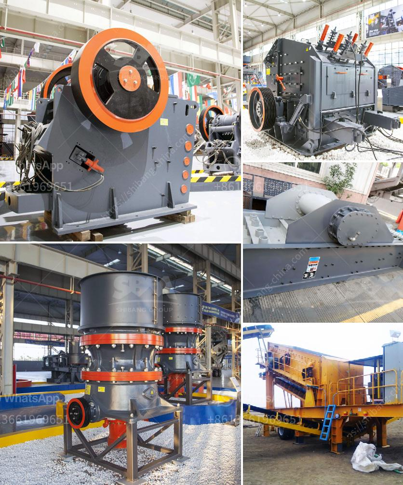

<h3>quarry stone crushing machine manufacturers</h3>
Quarry stone crushing machine manufacturers have expanded their production capacity, paving the way for contractors to engage in higher volumes of road and building construction projects.

Quarrying is a specialist form of mining that involves extracting materials such as metals, stones, and sand from the earth's surface. This process is carried out using heavy machinery, including crushing machines that break down the raw materials into smaller, more manageable sizes.

As the demand for construction materials continues to rise, quarry stone crushing machine manufacturers are investing in new technologies to meet the ever-growing needs of the construction industry. With these innovations, manufacturers are able to produce higher quality and more efficient machines.

One of the key priorities for manufacturers is to increase the durability and reliability of their machines. This is essential for continuous operation at quarries, where downtime can be costly. By using stronger and more durable materials, manufacturers are ensuring that their machines can withstand the harsh conditions of quarrying operations.

Additionally, manufacturers are leveraging advancements in automation and control systems to enhance the efficiency of their machines. These technologies enable quarry stone crushing machines to operate at optimal levels, reducing both fuel consumption and overall operating costs. This is good news for contractors, as it allows them to complete projects more quickly and at a lower cost.

Furthermore, quarry stone crushing machine manufacturers are also focusing on environmental sustainability. They are developing machines that are more energy-efficient and produce fewer emissions. This not only reduces the impact on the environment but also ensures compliance with stricter environmental regulations.

In order to cater to the specific needs of different customers, manufacturers are offering a wide range of crushing machines. These machines come in various sizes and capacities to handle different types of materials. This flexibility allows contractors to choose the most suitable machine for their specific project requirements.

To further support customers, quarry stone crushing machine manufacturers are providing comprehensive after-sales services. This includes offering spare parts, technical support, and training for machine operators. By doing so, manufacturers are ensuring that their customers can maintain and operate their machines effectively, ultimately improving their productivity and profitability.

Overall, quarry stone crushing machine manufacturers play a crucial role in the construction industry. Their machines are instrumental in extracting the necessary materials for road and building construction projects. With their focus on durability, efficiency, and sustainability, manufacturers are meeting the growing demands of contractors and ensuring the smooth progress of construction projects.
<h3>Contact us</h3><ul><li><strong>Whatsapp:&nbsp;<a href="https://wa.me/8613661969651">+8613661969651</a></strong></li><li><a href="https://swt.shibang-china.com/?git&amp;zhl&amp;quarry stone crushing machine manufacturers"><strong>Online Service(chat now)</strong></a></li></ul><h3>Related</h3><ul><li><a href='roller crusher price list.md'>roller crusher price list</a></li><li><a href='small mobile stone crushers.md'>small mobile stone crushers</a></li><li><a href='baxter stone crusher in uk.md'>baxter stone crusher in uk</a></li><li><a href='vertical ball grinding mills.md'>vertical ball grinding mills</a></li><li><a href='raymond bowl coal mill drawings.md'>raymond bowl coal mill drawings</a></li></ul>