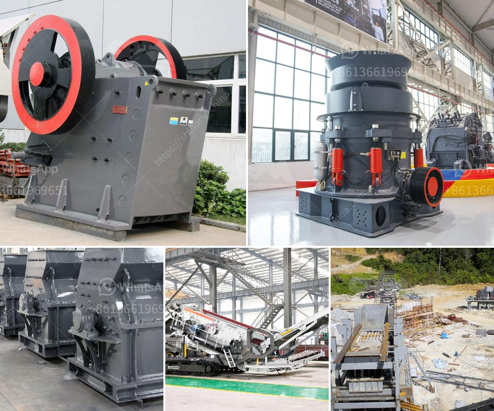

<h3>quarry stone supplier in dubai</h3>
Quarries are vital for the construction industry as they provide the raw materials required for various projects. In Dubai, one prominent supplier of quarry stone aggregates is the Bin Lahej Crushers.

Bin Lahej Crushers is one of the leading quarry stone suppliers in the UAE, offering a wide range of high-quality quarry products such as crushed rock, gravel, sand, and stone powder. They deal with all types of construction projects, including buildings, roads, and bridges.

With a team of highly skilled professionals and state-of-the-art equipment, Bin Lahej Crushers ensures efficient extraction and crushing of the quarried stone. They follow stringent quality control measures to deliver consistent and reliable products to their clients.

One of the key advantages of sourcing quarry stone from Bin Lahej Crushers is their strategic location. They are conveniently situated in the Al Taween-Fujairah area, which allows for easy transportation of materials to various parts of Dubai and beyond. This helps reduce logistical challenges and ensures timely delivery of products to construction sites, saving both time and money for project developers.

Furthermore, Bin Lahej Crushers places great emphasis on sustainability and environmental protection. They adhere to strict environmental regulations and constantly work towards minimizing their carbon footprint. By implementing innovative techniques and investing in eco-friendly machinery, they ensure the preservation of the natural landscape surrounding their quarries.

In addition to their commitment to sustainability, Bin Lahej Crushers also prioritizes customer satisfaction. They are known for their excellent customer service, providing timely assistance and guidance throughout the entire purchasing process. Their team of experts is always available to answer any queries and provide customized solutions based on the specific requirements of each project.

Another notable aspect of Bin Lahej Crushers is their competitive pricing. Despite offering high-quality quarry stone products, they strive to keep their prices affordable. This makes them a preferred choice among contractors and developers who are looking for cost-effective solutions without compromising on the quality of materials.

Furthermore, Bin Lahej Crushers has established a strong reputation in the industry for consistently delivering products that meet international quality standards. They have earned various certifications and accreditations, including ISO 9001, ISO 14001, and OHSAS 18001, which further validate their commitment to excellence.

Overall, Bin Lahej Crushers stands out as a reliable and trusted quarry stone supplier in Dubai. Their focus on quality, sustainability, customer satisfaction, and competitive pricing has made them a preferred choice among construction professionals. With their extensive range of quarry products and efficient operations, they continue to contribute to the growth and development of the construction industry in Dubai and beyond.
<h3>Contact us</h3><ul><li><strong>Whatsapp:&nbsp;<a href="https://wa.me/8613661969651">+8613661969651</a></strong></li><li><a href="https://swt.shibang-china.com/?git&amp;zhl&amp;quarry stone supplier in dubai"><strong>Online Service(chat now)</strong></a></li></ul><h3>Related</h3><ul><li><a href='mining industry in mpumalanga.md'>mining industry in mpumalanga</a></li><li><a href='ceramic mortar powder grinding mill in nigeria.md'>ceramic mortar powder grinding mill in nigeria</a></li><li><a href='saudi arabia used conveyor belts price.md'>saudi arabia used conveyor belts price</a></li><li><a href='laboratory grinding mills jaw crushers.md'>laboratory grinding mills jaw crushers</a></li><li><a href='ballast ore crusher for sale in kenya.md'>ballast ore crusher for sale in kenya</a></li></ul>